# 结题报告


## 小组成员以及分工

* 黄与进：ros的资料查找、安装、学习，负责进行ros的环境配置以及控制和操作，编写多个小车调度的程序，调试与电脑端ros的通信。
* 刘津畅：RT-thread的资料查找、学习，硬件引脚和接口的调研、连接、配置，搭建、调试小车硬件，协助小车代码与硬件之间的适配。
* 陆子睦：RT-thread的资料查找、学习，RT-thread在STM32上的移植，RT-thread与ros的结合，以及RT-thread-ros控制单个小车的代码编写，报告及ppt制作。
* 唐星：ros的资料查找、安装、学习，ros的环境配置以及操作，控制多个小车代码的设计、编写，设计、编写计算小车最短路径的算法。
* 杨涛：rtthread的资料查找、学习，RT-thread Studio使用的研究，RT-thread和ros代码的编写，sel4上调用Linux虚拟机方案的尝试。


## 项目简介

随着智能硬件、物联网行业的迅猛发展, 嵌入式系统在各个领域都得到了广泛的应用。嵌入式操作系统可以帮助嵌入式设备更好地完成任务的调度，从而更高效地完成任务。目前，嵌入式系统正在向着功能日趋复杂，多机联合，分布式等方面发展。这些复杂的应用需要有较大的运算量，而传统的单片机是无法完成这些复杂的计算的。同时，要想实现复杂的功能，裸机编程也会因为过于困难且容易出错而难以实现。

鉴于以上这些背景，我们决定使用嵌入式操作系统RT_thread搭配ros的方式，来实现一个兼顾实时性和计算复杂性，符合当今嵌入式系统发展趋势的系统。


## 理论依据

### ros

 ros是机器人操作系统（Robot Operating System）的英文缩写。ROS是用于编写机器人软件程序的一种具有高度灵活性的软件架构。 提供了操作系统应有的服务，包括硬件抽象，底层设备控制，常用函数的实现，进程间消息传递，以及包管理。它也提供用于获取、编译、编写、和跨计算机运行代码所需的工具和库函数。

  

ROS 的主要目标是为机器人研究和开发提供代码复用的支持。ROS是一个分布式的进程（也就是“节点”）框架，这些进程被封装在易于被分享和发布的程序包和功能包中。ROS也支持一种类似于代码储存库的联合系统，这个系统也可以实现工程的协作及发布。这个设计可以使一个工程的开发和实现从文件系统到用户接口完全独立决策（不受ROS限制）。同时，所有的工程都可以被ROS的基础工具整合在一起。

虽然名叫机器人操作系统，但它其实并不是一个操作系统，而只是一些软件包，它的实时性完全是由它运行在其上的操作系统实现的，而传统上ros一般运行在Linux系统上或是运行在裸机上，然而Linux系统并不是专门的实时性操作系统，它的实时性并不是很好，而裸机编程又过于复杂不适合实现丰富的应用。所以我们决定在实时性操作系统RT-thread上运行ros，通过ros来与主节点上的ros通信，并可以把需要进行复杂的计算的信息发送给运行在PC端的主节点上的ros，在PC端进行运算，再通过运行结果来决定嵌入式系统的一些操作。


### RT-thread

RT-Thread，全称是 Real Time-Thread，顾名思义，它是一个嵌入式实时多线程操作系统，基本属性之一是支持多任务，允许多个任务同时运行并不意味着处理器在同一时刻真地执行了多个任务。事实上，一个处理器核心在某一时刻只能运行一个任务，由于每次对一个任务的执行时间很短、任务与任务之间通过任务调度器进行非常快速地切换（调度器根据优先级决定此刻该执行的任务），给人造成多个任务在一个时刻同时运行的错觉。在 RT-Thread 系统中，任务通过线程实现的，RT-Thread 中的线程调度器也就是以上提到的任务调度器。


RT-Thread 主要采用 C 语言编写，浅显易懂，方便移植。它把面向对象的设计方法应用到实时系统设计中，使得代码风格优雅、架构清晰、系统模块化并且可裁剪性非常好。针对资源受限的微控制器（MCU）系统，可通过方便易用的工具，裁剪出仅需要 3KB Flash、1.2KB RAM 内存资源的 NANO 版本（NANO 是 RT-Thread 官方于 2017 年 7 月份发布的一个极简版内核)；而对于资源丰富的物联网设备，RT-Thread 又能使用在线的软件包管理工具，配合系统配置工具实现直观快速的模块化裁剪，无缝地导入丰富的软件功能包，实现类似 Android 的图形界面及触摸滑动效果、智能语音交互效果等复杂功能。

相较于 Linux 操作系统，RT-Thread 体积小，成本低，功耗低、启动快速，除此以外 RT-Thread 还具有实时性高、占用资源小等特点，非常适用于各种资源受限（如成本、功耗限制等）的场合。虽然 32 位 MCU 是它的主要运行平台，实际上很多带有 MMU、基于 ARM9、ARM11 甚至 Cortex-A 系列级别 CPU 的应用处理器在特定应用场合也适合使用 RT-Thread。

综上，RT-thread的实时性和易用性都很高，与ros软件包可以实现完美的兼容，所以我们选择ros搭配RT-thread的模式。


### STM32开发板

我们的RT-thread主要运行在stm32的嵌入式开发版上。 STM32系列是专为要求高性能、低成本、低功耗的嵌入式应用设计的ARM Cortex-M0，M0+，M3, M4和M7内核开发板。 

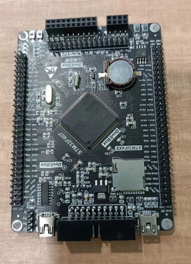

我们使用的是STM32F407开发板，性能较STM32F103高，完全可以支持RT-thread运行ros。而且STM32开发板生态比较成熟，容易获得uart和pwm等输出的方式，可以完美地控制小车的运行。


## 技术路线

### RT-thread-ros

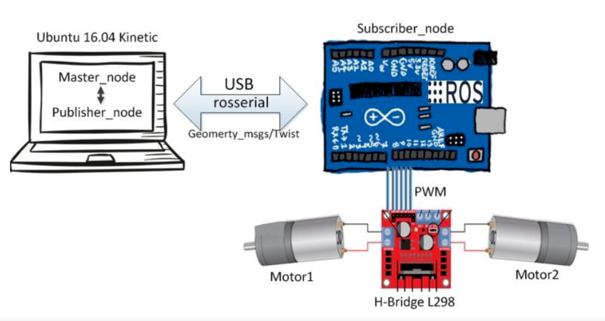

RT-thread-ros的主要思路是在stm32上运行RT-thread，并在RT-thread上运行ros的软件包rosserial，作为ros的从节点。rosserial可以与主节点之间通过TCP或串口等建立联系。然后通过Publisher和Subscriber进行消息的传递。

```c++
#include <ros.h>

ros::NodeHandle  nh; //开启一个节点（node handle）

	//Init node
    nh.initNode();

    // 订阅了一个话题
    nh.subscribe(sub);

    // 发布了一个话题
    nh.advertise(xv);

    // 发布了一个话题
    nh.advertise(xt);
```

这就可以建立RT-thread上的ros和PC端的ros之间的通信。


## 操作实现

首先，需要实现RT-thread与ros的结合。

RT-thread可以移植的ros软件包rosserial，从网上下载，然后添加到RT-thread工程中去。

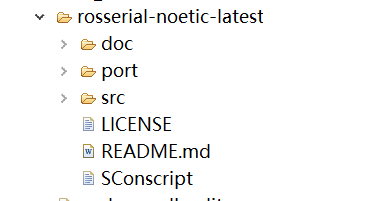

就是工程目录中的rosserial-noetic-latest，使用的是最新版本的ros1.

之后我们需要实现RT-thread端的ros与电脑端的ros的通信，从而验证RT-thread端的ros移植是成功的。于是我们通过在board.h中设置打开了uart2.

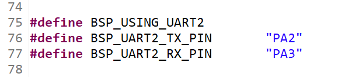

通过uart2与电脑连接，可以用于信息传输（其中可以看到PA2和PA3是tx和rx的引脚）。编译生成.hex文件之后，可以烧到STM32开发板上。

然后我们可以通过一个串口转usb的装置来把开发板和电脑连接起来。电脑检测到串口之后，在电脑上运行ros，出现如下信息，说明已经实现了电脑端ros和RT-thread端ros的通信，RT-thread端ros已经成功跑了起来。

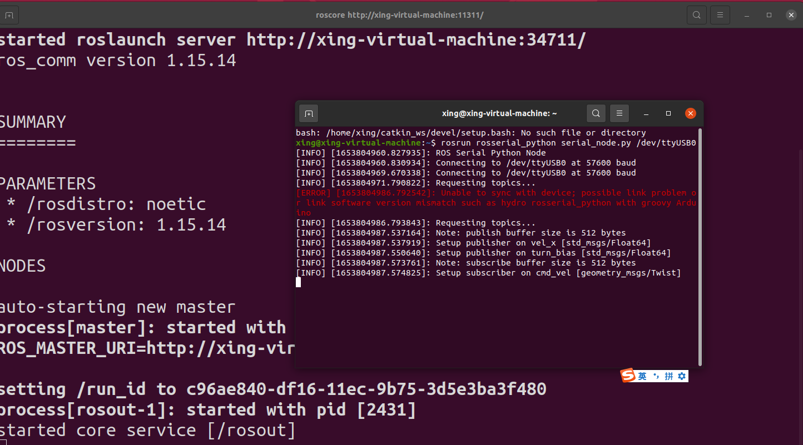

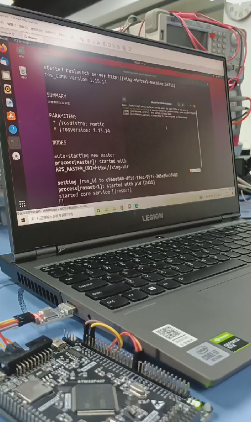、

接下来我们就可以进行RT-thread-ros的应用。

## RT-thread-ros的应用

### RT-thread-ros单个小车

由于小车是运动的，所以不能使用串口转usb与电脑连接，需要使用TCP连接，所以首先需要实现RT-thread联网。首先在RT-thread中添加at_device，使用ESP8266固件联网从而实现联网的功能。

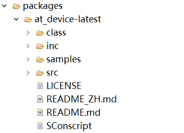

ESP8266固件：

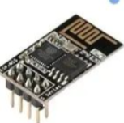

ESP8266需要使用 esptool 初始化：

```
$ esptool.exe --port com5 erase_flash
$ esptool.exe --port com5 write_flash --flash_mode dout 0 Ai-Thinker_ESP8266_DOUT_8Mbit_v1.5.4.1-a_20171130.bin
```

然后通过按照引脚的对应关系把ESP8266固件连接到开发板上。

同时，要控制小车还需要在RT-thread工程里添加与pwm相关的代码，在timer3上打开两路pwm。在board.h里添加pwm3的定义。

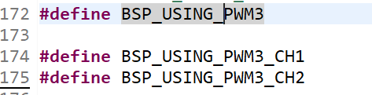

在CubeMX中timer3上打开两路pwm

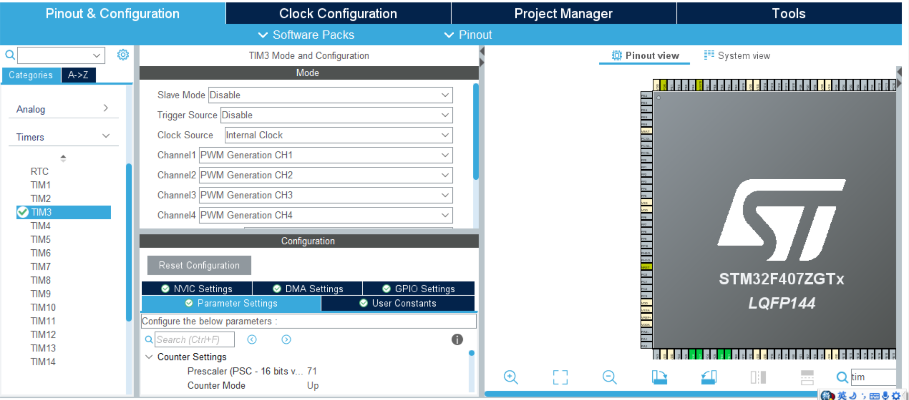

然后再通过CubeMS生成相关代码，并在board.c里添加下列函数：

```c
void HAL_TIM_PWM_MspInit(TIM_HandleTypeDef* htim_pwm)
{
  if(htim_pwm->Instance==TIM3)
  {
  /* USER CODE BEGIN TIM3_MspInit 0 */

  /* USER CODE END TIM3_MspInit 0 */
    /* Peripheral clock enable */
    __HAL_RCC_TIM3_CLK_ENABLE();
  /* USER CODE BEGIN TIM3_MspInit 1 */

  /* USER CODE END TIM3_MspInit 1 */
  }

}

void HAL_TIM_MspPostInit(TIM_HandleTypeDef* htim)
{
  GPIO_InitTypeDef GPIO_InitStruct = {0};
  if(htim->Instance==TIM3)
  {
  /* USER CODE BEGIN TIM3_MspPostInit 0 */

  /* USER CODE END TIM3_MspPostInit 0 */

    __HAL_RCC_GPIOA_CLK_ENABLE();
    __HAL_RCC_GPIOB_CLK_ENABLE();
    /**TIM3 GPIO Configuration
    PA6     ------> TIM3_CH1
    PA7     ------> TIM3_CH2
    PB0     ------> TIM3_CH3
    PB1     ------> TIM3_CH4
    */
    GPIO_InitStruct.Pin = GPIO_PIN_6|GPIO_PIN_7;
    GPIO_InitStruct.Mode = GPIO_MODE_AF_PP;
    GPIO_InitStruct.Pull = GPIO_NOPULL;
    GPIO_InitStruct.Speed = GPIO_SPEED_FREQ_LOW;
    GPIO_InitStruct.Alternate = GPIO_AF2_TIM3;
    HAL_GPIO_Init(GPIOA, &GPIO_InitStruct);

    GPIO_InitStruct.Pin = GPIO_PIN_0|GPIO_PIN_1;
    GPIO_InitStruct.Mode = GPIO_MODE_AF_PP;
    GPIO_InitStruct.Pull = GPIO_NOPULL;
    GPIO_InitStruct.Speed = GPIO_SPEED_FREQ_LOW;
    GPIO_InitStruct.Alternate = GPIO_AF2_TIM3;
    HAL_GPIO_Init(GPIOB, &GPIO_InitStruct);

  /* USER CODE BEGIN TIM3_MspPostInit 1 */

  /* USER CODE END TIM3_MspPostInit 1 */
  }

}
```


我们实现RT-Thread-ros控制单个小车运行，进行遥控。


开启ros收发消息代码：

```cpp
ros::NodeHandle  nh; //开启一个节点（node handle）
MotorControl mtr(1, 2);   //Motor

bool msgRecieved = false;
float velX = 0, turnBias = 0; //前进速度和偏转角度
char stat_log[200];

// 接收到命令时的回调函数
void velCB( const geometry_msgs::Twist& twist_msg)
{
  velX = twist_msg.linear.x; //设置前进速度，linear.x指向机器人前方
  //设置偏转角度，angular.z代表平面机器人的角速度，因为此时z轴为旋转轴
  turnBias = twist_msg.angular.z;
  msgRecieved = true; //标记接收到了消息
}
//Subscriber
//创建一个Subscriber，消息管道为cmd_vel,注册回调函数为velCB
ros::Subscriber<geometry_msgs::Twist> sub("cmd_vel", velCB );

//Publisher
std_msgs::Float64 velX_tmp;
std_msgs::Float64 turnBias_tmp;
ros::Publisher xv("vel_x", &velX_tmp);//发送当前速度
ros::Publisher xt("turn_bias", &turnBias_tmp);//发送当前偏转角度

```

控制小车的线程函数：

```cpp
static void rosserial_thread_entry(void *parameter)
{
    //Init motors, specify the respective motor pins
    mtr.initMotors();

    //Init node
    nh.initNode();

    // 订阅了一个话题 /cmd_vel 接收控制指令
    nh.subscribe(sub);

    // 发布了一个话题 /vel_x 告诉 ROS 小车速度
    nh.advertise(xv);

    // 发布了一个话题 /turn_bias 告诉 ROS 小车的旋转角速度
    nh.advertise(xt);

    mtr.stopMotors();

    while (1)
    {
      // 如果接收到了控制指令
      if (msgRecieved)
      {
        velX *= mtr.maxSpd; //转换速度
        mtr.moveBot(velX, turnBias);
        msgRecieved = false; //设置结束把标志置false
      }

      velX_tmp.data = velX;
      turnBias_tmp.data = turnBias/mtr.turnFactor; //设置publisher值

      // 更新话题内容
      xv.publish( &velX_tmp );
      xt.publish( &turnBias_tmp );

      nh.spinOnce(); //回调处理函数
    }
}
```

main函数：

```cpp
int main(void)
{
    // 启动一个线程用来和 ROS 通信
    rt_thread_t thread = rt_thread_create("rosserial",     rosserial_thread_entry, RT_NULL, 2048, 8, 10);
    if(thread != RT_NULL)
    {
        rt_thread_startup(thread);
        rt_kprintf("[rosserial] New thread rosserial\n");
    }
    else
    {
        rt_kprintf("[rosserial] Failed to create thread rosserial\n");
    }
    return RT_EOK;
}
```

同时，还需要ros电脑端的代码，通过在电脑端创建ros包，从而控制小车。

检测按键发送指令的函数：

```python
def on_press(key):

    try:
        if(key.char == 'w'):
            print("Forward")
            vel.linear.x = 0.8
           vel.angular.z = 0
        
        if(key.char == 's'):
            print("Backward")
            vel.linear.x = -0.8
            vel.angular.z = 0

        if(key.char == 'a'):
            print("Counter Clockwise")
            vel.linear.x = 0
            vel.angular.z = -0.8

        if(key.char == 'd'):
            print("Clockwise")
            vel.linear.x = 0
            vel.angular.z = 0.8

        return False

    except AttributeError:
        print('special key {0} pressed'.format(key))
        return False
```

发送消息的代码：

```python
# Init Node
rospy.init_node('my_cmd_vel_publisher')
pub = rospy.Publisher('cmd_vel', Twist, queue_size=10)

# Set rate
rate = rospy.Rate(10)

listener = Listener(on_release=on_release, on_press = on_press)

while not rospy.is_shutdown():
    print(vel.linear.x)
    pub.publish(vel)
    vel.linear.x = 0
    vel.angular.z = 0
    rate.sleep()

    if not listener.running:
        listener = Listener(on_release=on_release, on_press = on_press)
        listener.start()
 
```

这样就可以实现小车通过电脑端的w、s、a、d来实现向前，向后，向左和向右运动。

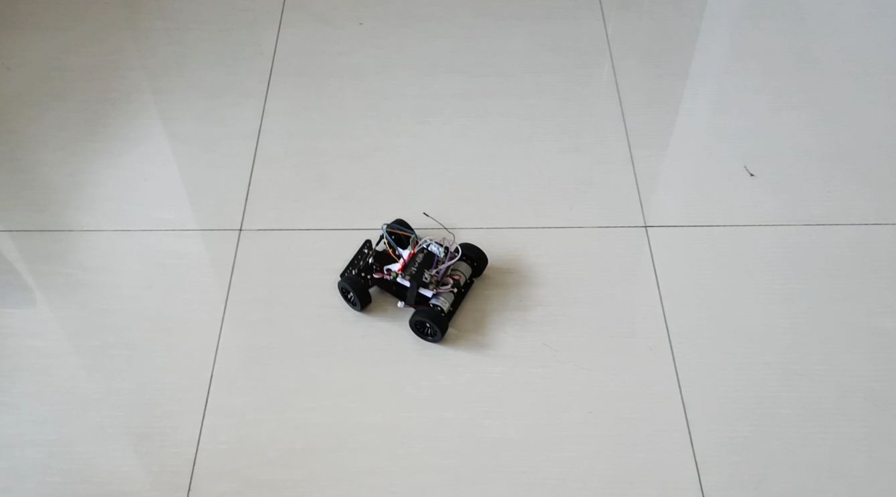


### RT-thread-ros多车调度：消毒

背景：农田杀虫。车a进行巡逻，通过摄像头采集数据，确定具体待杀虫地点后发送相关数据给ROS的PC端，PC端根据地点数据进行计算，得出最佳路径，从而控制车b按最短路径进行运动踩点，从而达到处理病虫害的效果。 

由于硬件和时间精力的限制，我们组在实现这个模拟的时候对条件作了一定的简化，没有采用摄像头，而是使用了预设好的地点坐标，车的运动也完全是靠速度、转角和时间来控制的。主要的实现方案是车a按照已经预设好的环形路线进行运动，然后在一段时间后把一系列点的坐标传到PC端，然后PC端计算出经过这些点的最佳顺序，然后通过ros通信控制车b，引导车b依次经过那些点。由于没有摄像头，无法进行数据采集，所以只能预设好位置，用xy坐标表示，并通过控制小车的方向和速度来控制小车位置的移动。

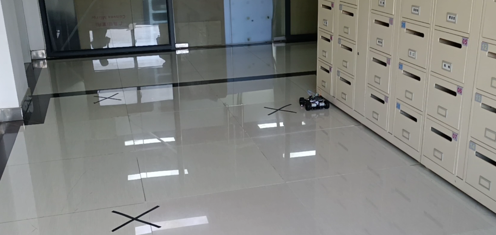

​                                                                                        车a

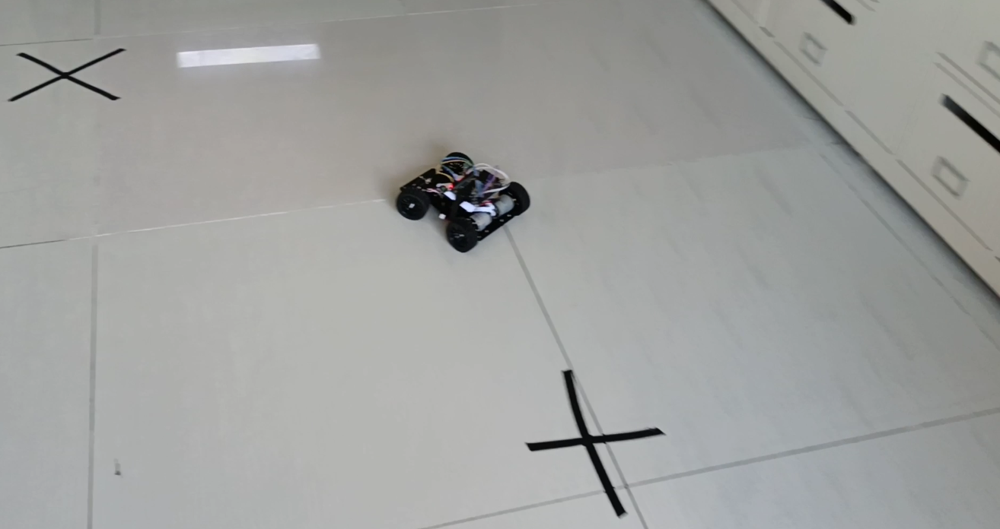

​                                                                                       车b

按照这种小车控制方法走出的路径和预期可能有一定的偏差，控制并不是十分精确，不过这个模拟已经可以体现出我们的RT-Thread-ros系统广泛的应用场景和无限可能，所以在这个角度看这个模拟实验还是达到了它的效果的。


## 总结与展望

本小组一开始是希望能够用混合内核的方式，使用一个实时性较好的微内核调用Linux，从而实现实时性和技术复杂性的兼顾，我们也尝试了这种方案，不过由于一些瓶颈没有实现。

我们的实现过程是这样的：

选择seL4微内核，其带有已经带有虚拟机组件，使用 CAmkES 来创建、配置和构建虚拟机从而运行 guest Linux，编写简单测试程序并加入内核编译链，并且搭建相关的编译环境。

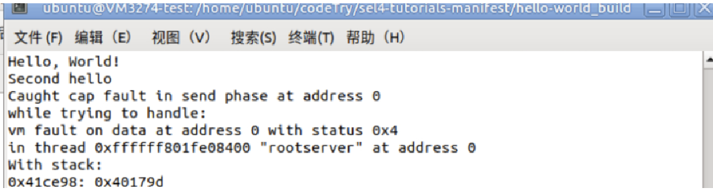


进行VMM组件的搭建与linux的运行，在内核编译完成之后使用qemu进行模拟，但在尝试模拟的过程之中出现了如图的错误。

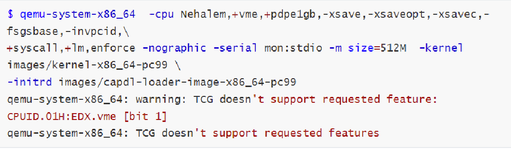

我们认为可能是硬件不兼容的原因，不过并不是非常确定。由于这个错误没有找到解决方法，所以这个线路只能放弃。

### RT-Thread-ros的优势：

- 实时性操作系统，有硬实时性，实时性好。
- 利用ros把复杂计算传回pc端进行，有执行复杂计算任务的能力。
- 比起裸机编程，实时性操作系统更适合完成复杂任务。

### 不足与展望：

不足：

- 小车控制比较粗糙，路径有误差
- 未能实现实时内核+Linux的混合内核

展望：

- 在这个项目基础上实现分布式车辆调度
- 单个主节点变为分布式集群
- 小车上激光、雷达、摄像头应用
- ......

## 参考文献

 [stm32_百度百科 (baidu.com)](https://baike.baidu.com/item/stm32/9133302)

 [RT-Thread, RTOS, 物联网操作系统 - RT-Thread物联网操作系统](https://www.rt-thread.org/) 

 [RT-Thread 简介](https://www.rt-thread.org/document/site/#/rt-thread-version/rt-thread-standard/README) 

 [ros（机器人操作系统）_百度百科 (baidu.com)](https://baike.baidu.com/item/ros/4710560) 

 [ros图片_百度百科 (baidu.com)](https://baike.baidu.com/pic/ros/4710560/0/7870145557bce9aab645ae31?fr=lemma&ct=single#aid=1&pic=4e4a20a4462309f717e9339e780e0cf3d6cad6bc) 

 [(8条消息) ros+modelarts实现多车辆协作_Wyd_(ง •̀_•́)ง的博客-CSDN博客](https://blog.csdn.net/qq_44181970/article/details/113531789) 

 [基于ROS的多机器人编队仿真 - 古月居 (guyuehome.com)](https://www.guyuehome.com/8907) 

