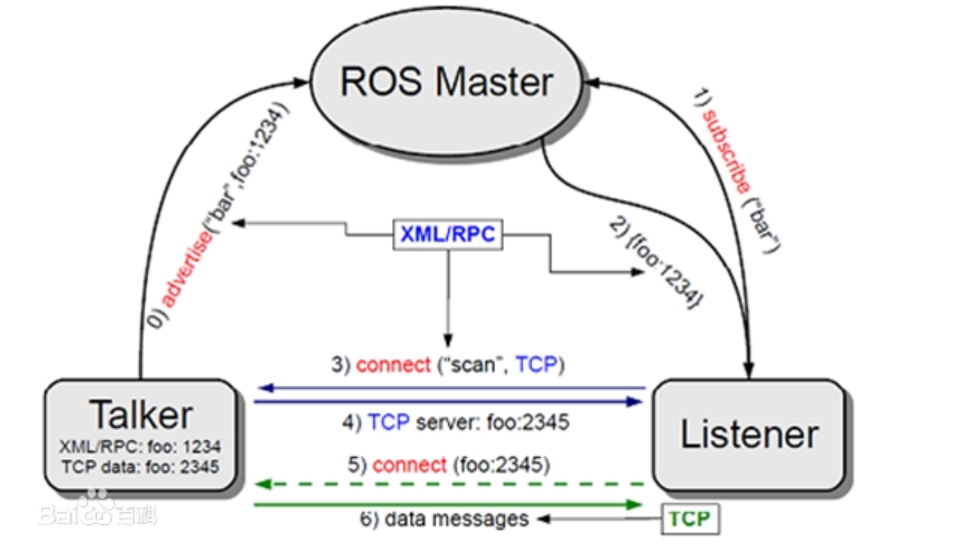
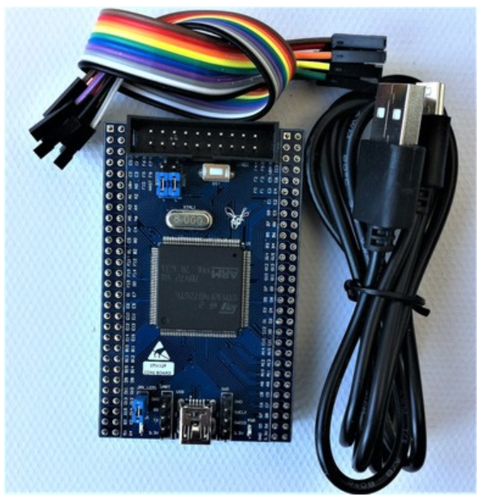
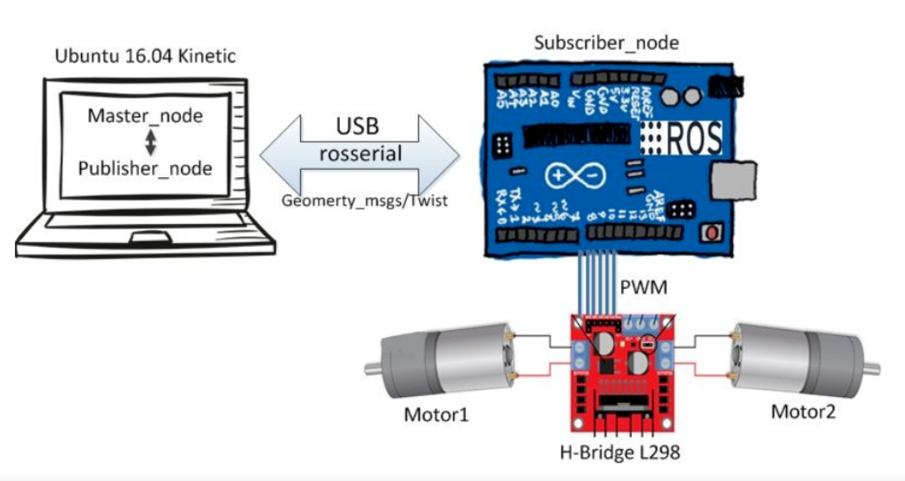
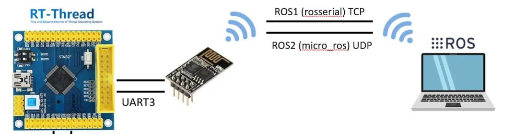

# 可行性报告


[TOC]

## 小组成员

* 黄与进
* 刘津畅
* 陆子睦
* 唐星
* 杨涛


## 项目简介

随着智能硬件、物联网行业的迅猛发展, 嵌入式系统在各个领域都得到了广泛的应用。嵌入式操作系统可以帮助嵌入式设备更好地完成任务的调度，从而更高效地完成任务。目前，嵌入式系统正在向着功能日趋复杂，多机联合，分布式等方面发展。这些复杂的应用需要有较大的运算量，而传统的单片机是无法完成这些复杂的计算的。同时，要想实现复杂的功能，裸机编程也会因为过于困难且容易出错而难以实现。

鉴于以上这些背景，我们决定使用嵌入式操作系统RT_thread搭配ros的方式，来实现一个兼顾实时性和计算复杂性，符合当今嵌入式系统发展趋势的系统。


## 理论依据

### ros

 ros是机器人操作系统（Robot Operating System）的英文缩写。ROS是用于编写机器人软件程序的一种具有高度灵活性的软件架构。 提供了操作系统应有的服务，包括硬件抽象，底层设备控制，常用函数的实现，进程间消息传递，以及包管理。它也提供用于获取、编译、编写、和跨计算机运行代码所需的工具和库函数。

  

ROS 的主要目标是为机器人研究和开发提供代码复用的支持。ROS是一个分布式的进程（也就是“节点”）框架，这些进程被封装在易于被分享和发布的程序包和功能包中。ROS也支持一种类似于代码储存库的联合系统，这个系统也可以实现工程的协作及发布。这个设计可以使一个工程的开发和实现从文件系统到用户接口完全独立决策（不受ROS限制）。同时，所有的工程都可以被ROS的基础工具整合在一起。

虽然名叫机器人操作系统，但它其实并不是一个操作系统，而只是一些软件包，它的实时性完全是由它运行在其上的操作系统实现的，而传统上ros一般运行在Linux系统上或是运行在裸机上，然而Linux系统并不是专门的实时性操作系统，它的实时性并不是很好，而裸机编程又过于复杂不适合实现丰富的所以我们决定在实时性操作系统RT-thread上运行ros，通过ros来与主节点上的ros通信，并可以把需要进行复杂的计算的信息发送给运行在PC端的主节点上的ros，在PC端进行运算，再通过运行结果来决定嵌入式系统的一些操作。


### RT-thread

RT-Thread，全称是 Real Time-Thread，顾名思义，它是一个嵌入式实时多线程操作系统，基本属性之一是支持多任务，允许多个任务同时运行并不意味着处理器在同一时刻真地执行了多个任务。事实上，一个处理器核心在某一时刻只能运行一个任务，由于每次对一个任务的执行时间很短、任务与任务之间通过任务调度器进行非常快速地切换（调度器根据优先级决定此刻该执行的任务），给人造成多个任务在一个时刻同时运行的错觉。在 RT-Thread 系统中，任务通过线程实现的，RT-Thread 中的线程调度器也就是以上提到的任务调度器。


RT-Thread 主要采用 C 语言编写，浅显易懂，方便移植。它把面向对象的设计方法应用到实时系统设计中，使得代码风格优雅、架构清晰、系统模块化并且可裁剪性非常好。针对资源受限的微控制器（MCU）系统，可通过方便易用的工具，裁剪出仅需要 3KB Flash、1.2KB RAM 内存资源的 NANO 版本（NANO 是 RT-Thread 官方于 2017 年 7 月份发布的一个极简版内核)；而对于资源丰富的物联网设备，RT-Thread 又能使用在线的软件包管理工具，配合系统配置工具实现直观快速的模块化裁剪，无缝地导入丰富的软件功能包，实现类似 Android 的图形界面及触摸滑动效果、智能语音交互效果等复杂功能。

相较于 Linux 操作系统，RT-Thread 体积小，成本低，功耗低、启动快速，除此以外 RT-Thread 还具有实时性高、占用资源小等特点，非常适用于各种资源受限（如成本、功耗限制等）的场合。虽然 32 位 MCU 是它的主要运行平台，实际上很多带有 MMU、基于 ARM9、ARM11 甚至 Cortex-A 系列级别 CPU 的应用处理器在特定应用场合也适合使用 RT-Thread。

我们的RT-thread主要运行在stm32的嵌入式开发版上。 STM32系列是专为要求高性能、低成本、低功耗的嵌入式应用设计的ARM Cortex-M0，M0+，M3, M4和M7内核开发板。 



我们使用的是STM32F407开发板，性能较STM32F103高，完全可以支持RT-thread运行ros。


## 技术路线

### RT-thread-ros



RT-thread-ros的主要思路是在stm32上运行RT-thread，并在RT-thread上运行ros的软件包rosserial，作为ros的从节点。rosserial可以与主节点之间通过TCP或串口等建立联系。然后通过Publisher和Subscriber进行消息的传递。

```c++
#include <ros.h>

ros::NodeHandle  nh; //开启一个节点（node handle）

	//Init node
    nh.initNode();

    // 订阅了一个话题
    nh.subscribe(sub);

    // 发布了一个话题
    nh.advertise(xv);

    // 发布了一个话题
    nh.advertise(xt);
```

首先，我们需要建立RT-thread上的ros和PC端的ros之间的通信。


### RT-thread-ros单个小车

我们将会实现RT-Thread-ros控制单个小车运行，进行遥控。



这里由于stm32在小车上，所以需要使用ESP8266 联网。

ESP8266需要使用 esptool 初始化：

```
$ esptool.exe --port com5 erase_flash
$ esptool.exe --port com5 write_flash --flash_mode dout 0 Ai-Thinker_ESP8266_DOUT_8Mbit_v1.5.4.1-a_20171130.bin
```

然后RT-thread需要添加一行代码：

```
nh.getHardware()->setConnection("192.168.1.210", 11411);
```

这样就可以实现TCP通信。


### RT-thread-ros多车调度：杀虫

背景：车a进行巡逻，通过摄像头采集数据，当发现病虫害时发消息给车b，车b接到消息后前往进行消毒。 

主要的实现方案是车a按照已经预设好的路线进行运动，然后在一段时间后把一个信号传到PC端，然后PC端通过ros把车b引导到一个特定的位置，之后再控制车b返回。由于没有摄像头，无法进行数据采集，所以只能预设好位置，用xy坐标表示，并通过控制小车的方向和速度来控制小车位置的移动。


### RT-thread-ros多车调度：列队前进

 编队方法参考领航者-跟随者方法，队形选择为纵行编队。


 优点： 1）领航者-跟随者方法较简单，纵行编队为最基础简易的队形； 2）纵行编队在复杂环境下行驶较灵活（转弯、避障等方面），有利于之后自主导航加多车编队结合的工作。 


## 参考文献

 [stm32_百度百科 (baidu.com)](https://baike.baidu.com/item/stm32/9133302)

 [RT-Thread, RTOS, 物联网操作系统 - RT-Thread物联网操作系统](https://www.rt-thread.org/) 

 [RT-Thread 简介](https://www.rt-thread.org/document/site/#/rt-thread-version/rt-thread-standard/README) 

 [ros（机器人操作系统）_百度百科 (baidu.com)](https://baike.baidu.com/item/ros/4710560) 

 [ros图片_百度百科 (baidu.com)](https://baike.baidu.com/pic/ros/4710560/0/7870145557bce9aab645ae31?fr=lemma&ct=single#aid=1&pic=4e4a20a4462309f717e9339e780e0cf3d6cad6bc) 

 [(8条消息) ros+modelarts实现多车辆协作_Wyd_(ง •̀_•́)ง的博客-CSDN博客](https://blog.csdn.net/qq_44181970/article/details/113531789) 

 [基于ROS的多机器人编队仿真 - 古月居 (guyuehome.com)](https://www.guyuehome.com/8907) 

