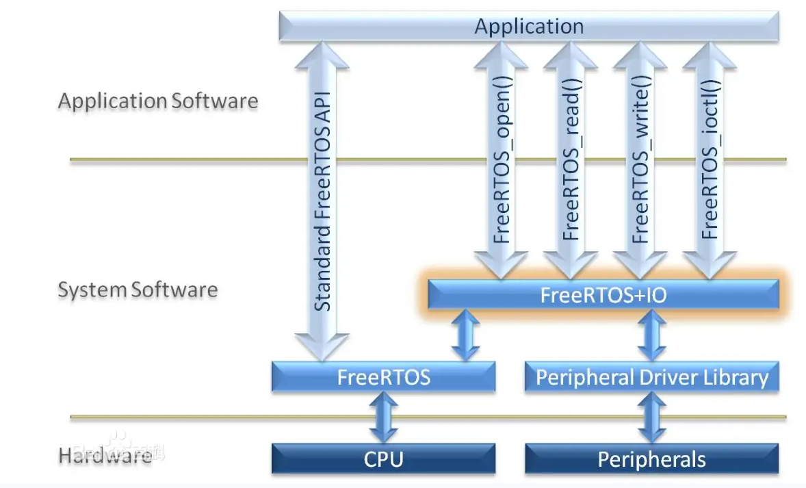
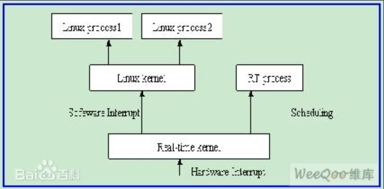
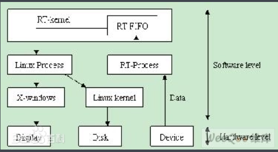
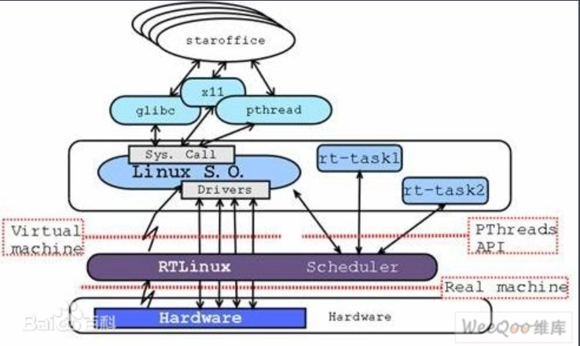
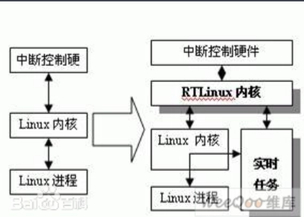
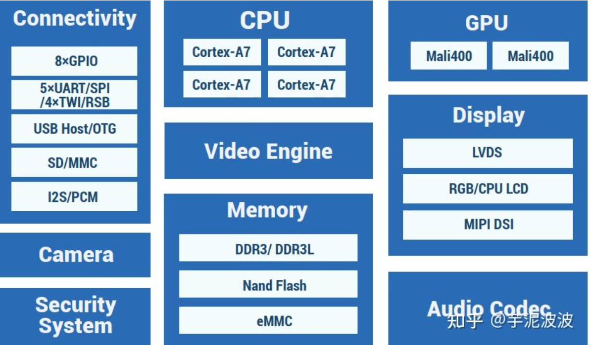
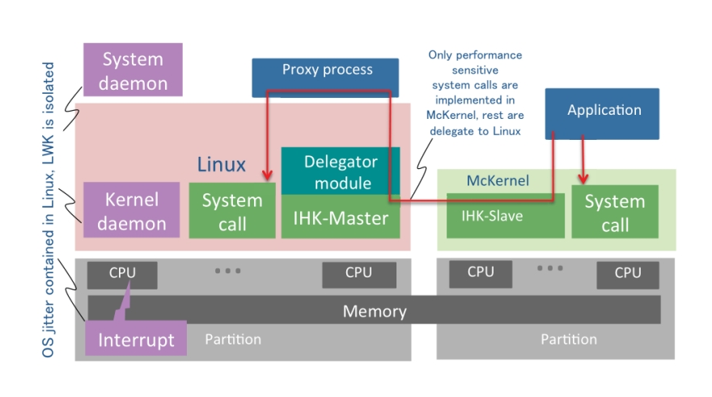
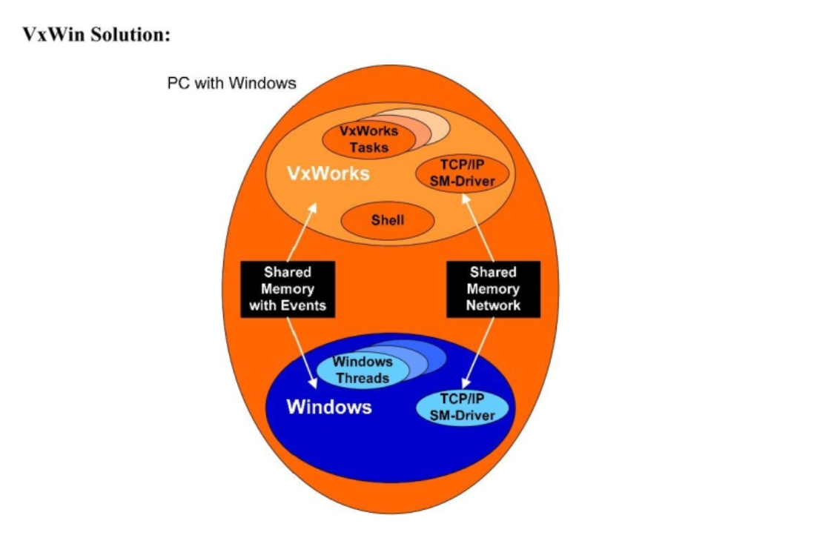
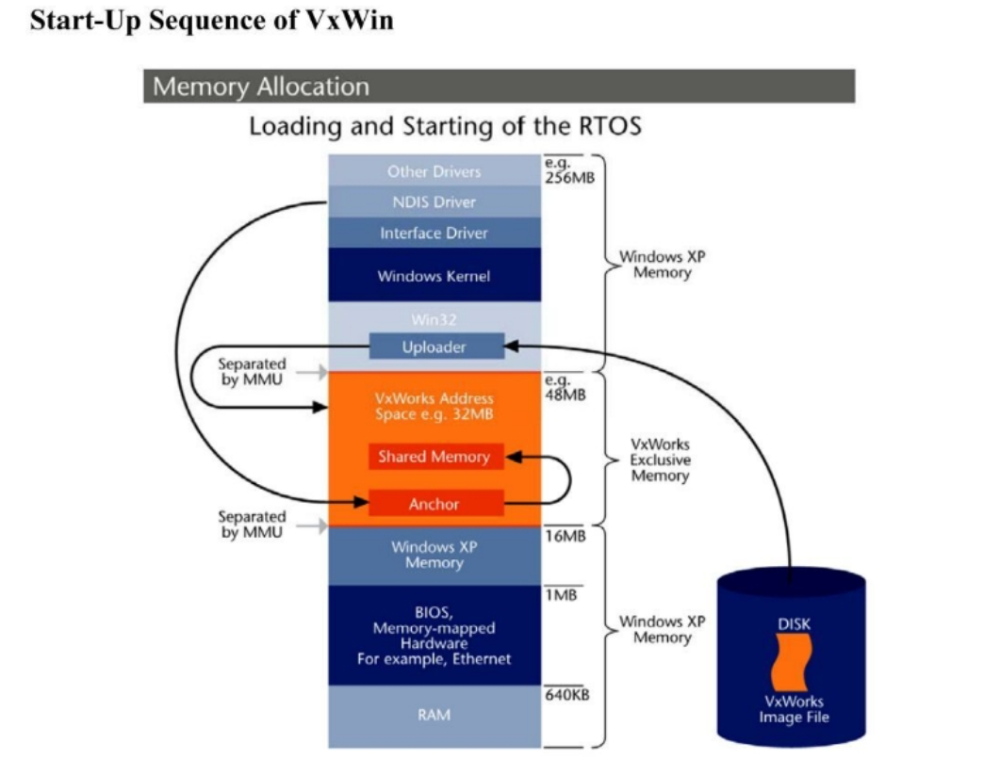

# 调研报告

## 小组成员

* 陆子睦
* 黄与进
* 刘津畅
* 唐星
* 杨涛

## 项目简介

随着智能硬件、物联网行业的迅猛发展, 嵌入式系统在各个领域都得到了广泛的应用。嵌入式操作系统可以帮助嵌入式设备更好地完成任务的调度，从而更高效地完成任务。在这其中，FreeRTOS由于其开源、免费、轻量级、可裁剪、实时性强、多种组件支持多等特点成为目前市场上最为主流的嵌入式操作系统。然而，FreeRTOS也存在过于简单、GUI等功能不能轻易支持等问题。随着时代的发展，内存的成本越来越低，嵌入式设备也在向着内存增加的方向发展。同时，一些系统中，有着实时性任务和非实时性任务并存的情况。这种情况下，单独只有一个FreeRTOS这样的嵌入式操作系统显然是不够用的，只有Linux这样的实时性较弱的操作系统也不能满足要求，而用两个独立的核又会产生信息交互等一系列麻烦的问题。所以，我们组参考了一些其他操作系统的实现方案，决定实现一个使用FreeRTOS来完成实时任务，并把Linux作为一个模块来调用的混合内核操作系统，从而满足当下这种需求。

同时，FreeRTOS的内存管理只支持连续性内存分配，而连续性内存分配有不灵活、内存容易不够用、碎片较难处理等问题，所以当今主流操作系统都使用非连续性内存分配，所以本组决定为FreeRTOS添加支持非连续性内存分配的MMU，从而达到提高FreeRTOS的内存分配弹性的效果。

## 项目背景

### FreeRTOS

#### 简介：

FreeRTOS是一个迷你的实时操作系统内核。作为一个轻量级的操作系统，功能包括：任务管理、时间管理、信号量、消息队列、内存管理、记录功能、软件定时器、协程等，可基本满足较小系统的需要。

#### 优点：

用户可配置内核功能、多平台的支持、提供一个高层次的信任代码的完整性、目标代码小，简单易用、遵循MISRA-C标准的编程规范、强大的执行跟踪功能、堆栈溢出检测、没有限制的任务数量、没有限制的任务优先级、多个任务可以分配相同的优先权、队列，二进制信号量，计数信号灯和递归通信和同步的任务、优先级继承、免费开源的源代码等。

#### 前景：

在嵌入式领域，FreeRTOS是不多的同时具有实时性，开源性，可靠性，易用性，多平台支持等特点的嵌入式操作系统。目前，FreeRTOS已经发展到支持包含X86，Xilinx，Altera等多达30种的硬件平台，其广阔的应用前景已经越来越受到业内人士的瞩目。

### FreeRTOS的一些缺点和不足：

1. 外延支持比较少。除操作系统外，freeRTOS只支持TCP、IP，而FS， USB ， GUI， CAN 等FreeRTOS都不支持，要加上也比较麻烦。
2. 系统的服务功能上， FreeRTOS 只提供了消息队列和信号量的实现，无法以后进先出的顺序向消息队列发送消息。

### FreeRTOS五种内存分配方式：

1. 直接在内存堆ucHeap中开辟内存块

2. 采用一种最佳匹配算法，并且可以回收已分配的内存空间。但是，该算法没有两个地址连续的空闲空间进行合并为一个空间，因此这样容易造成内存碎片。
3. 该内存管理方式是将标准的malloc()和free()进行了简单的封装。只是在封装的时候加入了调度器挂起和恢复操作。前两种方式内存管理是在系统申请的一个大数组中，该种方式是真正在堆中进行的。
4. 第四种分配算法与第二种基本相同，只是增加了一个合并算法，将相邻的空闲内存块合并成一个更大的空闲块。其实操作也是在申请的数组ucHeap中进行。
5. heap5允许内存堆可以跨越多个非连续的内存区域，对于上面讲的内存堆中heap1,heap2,heap4都是在一个定义好的大数组里进行的。heap5允许在多个不连续的内存空间。这里只是内存堆跨越多个非连续内存区域，不是真正意义上的分配时的不连续。

所以，可以看出，FreeRTOS在内存管理单元上还是有可以优化的空间的。我们组决定就此进行改进和创新，为FreeRTOS填上一个可以灵活分配非连续内存的内存管理单元。

### 非连续型内存管理

#### 基本分页存储管理方式

固定分区会产生内部碎片，动态分区会产生外部碎片，这两种技术对内存的利用率都比较低。为尽量避免碎片的产生，引入了分页的思想：把主存空间划分为大小相等且固定的块，块相对较小，作为主存的基本单位。每个进程也以块为单位进行划分，进程在执行时，以块为单位逐个申请主存中的块空间。

分页方法与固定分区技术不同点在于：块的大小相对于分区小很多，而且进程也按照块进行划分，进程运行时，按照块申请主存可用空间并执行。与分区留在较大的内部碎片不同，分页方式只会在最后一个主存块上留下页内碎片。

#### 基本分段存储管理方式

分页管理方式是从计算机的角度考虑设计的，以提高内存的利用率，提升计算机的性能, 且分页通过硬件机制实现，对用户完全透明；而分段管理方式的提出则是考虑了用户和程序员，以满足方便编程、信息保护和共享、动态增长及动态链接等多方面的需要。

段式管理方式按照用户进程中的自然段划分逻辑空间。例如，用户进程由主程序、两个子程序、栈和一段数据组成，于是可以把这个用户进程划分为5个段，每段从0 开始编址，并分配一段连续的地址空间（段内要求连续，段间不要求连续，因此整个作业的地址空间是二维的）。其逻辑地址由段号S与段内偏移量W两部分组成。

嵌入式操作系统有四大痛点（碎片化，低安全，弱交互和门槛高）和三大趋势（宏内核->微内核,嵌入式应用->小程序，软硬分离->软硬一体），而针对其中一个痛点***弱交互***，可以考虑内置Linux，使用其shell和广大的开源软件来增强其交互性，也可以提供对应设备的图形化窗口以便人工测试。而当前已有的内置Linux的实时系统如RTLinux已经过于古老，没有一个较为活跃的社区环境，故我们打算对于一个较为活跃的操作系统FreeRTOS，以混合内核的方式将其改造为可以支持内置linux的OS。

### 不同种类的操作系统调研

当今操作系统大概可以分为三个种类：宏内核、微内核和混合内核。

### 宏内核：

宏内核把所有的功能都耦合起来，放在内核中。

#### 宏内核的代表：Linux

#### 其内部是多模块耦合，其模块之间可以进行相互调用。所以这也是Linux的性能极高的原因。但可以看到图中各个模块的调用路劲从横交错，这就会出现一个地方出现问题，其他相关的地方可能都会出现问题，这是十分不安全的。

#### 宏内核优点

性能高，因为各个功能模块之间是可以直接调用的。

#### 宏内核缺点

因为各个模块是相互关联，容易出现一错皆错的问题。

### 微内核：

微内核与宏内核则恰恰相反，它为了降低耦合，内核中只会允许一些核心功能的存在，而其余所有功能都会被移出内核，变成一种特殊的用户进程——服务进程。

#### 微内核的代表：HarmonyOS

HarmonyOS采用了微内核方式，表现在应用层面，就是做到了将硬件功能模块化，可以更大自由度地按需调配组合，就像搭乐高积木一样；用户体验层面，不需要借助App整合，通过系统即可完成直连。

#### 微内核优点：

各个模块之间是独立的，不会相互影响，在安全性、稳定性和可维护性方面都优于宏内核。

#### 微内核缺点：

由于各个模块间通信比较麻烦，效率较低，性能相比宏内核会大幅度下降。不过当今一些算法，比如进程间通信、共享内存等可以对这个缺点有所改善。

### 混合内核：

混合内核则是结合上面二者的特点，它与微内核相似，只是会将一些功能模块又放回到内核中去，而不常用的功能模块还是放在用户层中。这样在微内核的基础上，又可以提高性能。

#### 混合内核代表：

1. #### Windows的NT内核：

 

最下层是硬件抽象层（HAL），在 HAL 层之上就是微软自己定义的小内核，也就是内核层中还包含着一个内核；

而在这个小内核之上就是各种执行体了，这些执行体提供了操作系统的文件系统缓存、对象管理、即插即用管理、虚拟内存、进程与线程、等服务。每个执行体互相独立，只对外提供相应的接口，其它执行体要通过相应的接口才能和其它执行体通信或者请求其完成相应的功能服务。

这有点类似于微内核的结构，各模块功能能相互独立。但又不同于微内核，因为这些功能模块都是在内核层的。NT从设计架构上看应该属于微内核结构，HAL层之上的小内核属于微内核的核心，小内核之上的执行体属于内核级别的应用层。而从权限的角度看属于宏内核，内核模式之下功能完备，并不像微内核那样功能稀少。这种设计兼顾了结构清晰和性能良好两个优点。所以NT应该算是混合内核。

 

 

2. #### MacOS的Darwin-XNU内核：

 

可以看到Darwin-XNU中有两个内核层，Mach层（微内核）和BSD层（宏内核）。Mach内核提供简单的进程、线程、IPC 通信、虚拟内存设备驱动相关的功能服务，而BSD则提供强大的安全特性，完善的网络服务，各种文件系统的支持，同时对Mach中的功能进行细化、扩展延伸。Darwin-XNU 内核层也成为了多内核架构的代表。

XNU是Mach和BSD的混合体。BSD层确保了Darwin系统的UNIX特性，真正的内核是Mach，但是对外部隐藏。BSD以上属于用户态，所有的内容都可以被应用程序访问，而应用程序不能访问内核态。当需要从用户态切换到内核态的时候，需要通过mach trap实现切换。

XNU 包含：Mach、微内核、BSD层、libkern、I/O Kit。

1） Mach 是 XNU的原子核，是一个微内核轻量级操作系统，仅处理最核心的任务：进程和线程抽象，任务调度，进程间通讯，和消息传递，虚拟内存管理。

BSD层是对Mach内核的包装，但是Mach系统调用仍然可以在用户态访问。需要借助mach trap实现用户态到内核态的转换。在32位系统上，Mach系统调用的编号都为负数，POSIX调用编号为非负。在64位系统上，Mach系统调用为正数，但是以0x2000000开头，而POSIX调用编号以0x1000000开头。

2） BSD层简历在Mach之上，确保了Darwin符合 POSIX 。提供了更高层次的功能，包括：UNIX 进程模型POSIX线程模型（Pthread）及相关的同步原语，UNIX 用户和组，网络协议栈（BSD Socket API），文件系统访问，设备访问（通过/dev目录访问）

  POSIX 兼容性是由XNU中BSD层提供的。所有的POSIX 系统调用不论底层实现如何都有相同的原型，也就是说具有相同的参数和返回值。系统调用编号：除了固定的原型之外，POSIX还完整定义了系统调用的编号。

3） Libken：在内核构建时都会采用 C 和汇编来实现，而 XNU 是采用 I/O Kit 来实现驱动，再次基础上可以瞒住 C++ 来实现编写。于是就在此的基础上包含 libKern 库。

4） I/O Kit是一个在内核中的完整的自包含的执行环境，让开发者可以使用C++快速创建设备驱动程序。I/O Kit 形成了受限环境 C++，并且带有 C++ 提供的功能：继承和重载。

 

### RT-Linux

RTLinux（AReal-Time Linux,亦称作实时Linux）是Linux中的一种实时操作系统。

RT-Linux开发者并没有针对实时操作系统的特性而重写Linux的内核，因为这样做的工作量非常大，而且要保证兼容性也非常困难。将linux的内核代码做一些修改，将linux本身的任务以及linux内核本身作为一个优先级很低的任务，而实时任务作为优先级最高的任务。即在实时任务存在的情况下运行实时任务，否则才运行linux本身的任务。RT-Linux能够创建精确运行的符合POSIX.1b标准的实时进程；并且作为一种遵循GPL v2协议的开放软件，可以达GPL v2协议许可范围内自由地、免费地使用、修改和再发生。

它是Linux在实时性方面的扩展，采用已获得专利的双核技术:一个微型的RTLinux内核把原始的Linux内核作为它在空闲时的一个线程来运行。这开启了在两个不同的内核层面上――实时的RTLinux内核和常用的，非实时的Linux内核――运行不同程序的新方式。原始的Linux内核通过RTLinux内核访问硬件。这样，所有硬件实际上都是由RTLinux来进行管理的。

现有的Linux是一个通用的操作系统，虽然它采用了许多技术来提高系统的运行和反应速度，但它本质上不是一个实时操作系统，应用于嵌入式环境中还存在诸多的不足。具体表现如下：

### 关中断问题

在系统调用中，为了保护临界区资源，Linux处于内核临界区时，中断会被系统屏蔽，这就意味着如果当前进程正处于临界区，即使它的优先级较低，也会延迟高优先级的中断请求。在实时应用中，这是一个十分严重的问题。

### 进程调度问题

Linux采用标准的UNIX技术使得内核是不可抢占的。采用基于固定时间片的可变优先级调度，不论进程的优先级多么低，Linux总会在某个时候分给该进程一个时间片运行，即使同时有可以运行的高优先级进程，它也必须等待低优先级进程的时间片用完，这对一些要求高优先级进程立即抢占CPU的实时应用是不能满足要求的。

### 时钟问题

Linux为了提高系统的平均吞吐率，将时钟中断的最小间隔设置为10ms，这对于一个周期性的实时任务，间隔要求小于10ms时，就不能满足实时任务的需要。如果要把时钟 的间隔改小以满足周期性的实时任务的需要，由于Linux的进程切换比较费时，时钟中断越频繁，而花在中断处理上的时间就越多,系统的大部分时间是调用进程调度程序进行进程调度而不能进行正常的处理。

**RTLinux的特点**

在Linux 操作系统中，调度算法（基于最大吞吐量准则）、设备驱动、不可中断的系统调用、中断屏蔽以及虚拟内存的使用等因素，都会导致系统在时间上的不可预测性，决定了Linux操作系统不能处理硬实时任务。RTLinux为避免这些问题，在Linux内核与硬件之间增加了一个虚拟层（通常称作虚拟机），构筑了一个小的、时间上可预测的、与Linux内核分开的实时内核，使得在其中运行的实时进程满足硬实时性。并且RTLinux和Linux构成一个完备的整体，能够完成既包括实时部分又包括非实时部分的复杂任务。

### 实现机理

RT-Linux对Linux内核进行改造，将Linux内核工作环境做了一些变化，如图1所示：

​																		图1 RTLinux对Linux内核改变

RTLinux有两种中断：硬中断和软中断。软中断是常规Linux内核中断。它的优点在于可无限制地使用Linux内核调用。硬中断是安装实时Linux的前提。依赖于不同的系统，实时Linux下硬中断的延迟是15μs。

​																				图2 RTLinux的体系结构

RTLinux的体系结构如图2所示。RTLinux的设计思想是:应用硬件的实时约束将实时程序分割成短小简单的部分,较大部分承担较复杂的任务。根据这一原则,将应用程序分为硬实时和软实时（即程序）2个部分。

**硬实时的实现：**

​																				图3 RT-FIFO结构图

图3所示的是RTFIFO结构图。RTLinux将标准Linux内核作为简单实时操作系统（RTOS）（或叫子内核）里优先权最低的线程来运行，从而避开了Linux内核性能的问题。 从图3可以看出，RTLinux拥有两个内核。这就意味着有两组单独的API，一个用于Linux环境，另一个用于实时环境。此外，为保证实时进程与非实时Linux进程不顺序进行数据交换，RTLinux引入了RT-FIFO队列。RT-FIFO被Linux视为字符设备，最多可达150个，分别命名为/dev/rtf0、/dev/rtf1……/dev/rtf63。最大的RT-FIFO数量在系统内核编译时设定。

RTLinux程序运行于用户空间和内核态两个空间。RTLinux提供了应用程序接口。借助这些API函数将实时处理部分编写成内核模块，并装载到RTLinux内核中，运行于RTLinux的内核态。非实时部分的应用程序则在Linux下的用户空间中执行。这样可以发挥Linux对网络和数据库的强大支持功能。

**软实时的实现:**

RTLinux通过一个高效的、可抢先的实时调度核心来全面接管中断，并把Linux作为此实时核心的一个优先级最低的进程运行。当有实时任务需要处理时，RTLinux运行实时任务；无实时任务时，RTLinux运行Linux的非实时进程。其系统结构见图4。

RTLinux在默认的情况下采用优先级的调度策略，即系统调度器根据各个实时任务的优先级来确定执行的先后次序。优先级高的先执行，优先级低的后执行，这样就保证了实时进程的迅速调度。同时RTLinux也支持其它的调度策略，如最短时限最先调度（EDP）、确定周期调度（RM）（周期段的实时任务具有高的优先级）。RTLinux将任务调度器本身设计成一个可装载的内核模块，用户可以根据自己的实际需要，编写适合自己的调度算法。

​																			图4 RTLinux系统结构图

对于一个操作系统而言，精确的定时机制虽然可以提高任务调度器的效率，但会增加CPU处理定时中断的时间开销。RTLinux对时间精度和时钟中断处理的时间开销进行了折中考虑。不是像Linux那样将8254定时器设计成10ms产生一次定时中断的固定模式，而是将定时器芯片设置为终端计时中断方式。根据最近的进程的时间需要，不断调整定时器的定时间隔。这样不仅可以获得高定时精度，同时中断处理的开销又最小。

本项目就是基于FreeRTOS，参考RT-Linux的实现方法，以混合内核的方式，实现微内核对宏内核的调用，从而满足当下一些系统（如汽车上既有汽车操纵的一些需要硬实时的任务，又有空调、车载音响等软实时的任务）的需求。由于FreeRTOS是目前市场上主流的嵌入式操作系统，有庞大的技术社区和资本支持，所以它相比于RT-Linux更为大众化，应用前景也更好。

## 立项依据

随着智能硬件、物联网行业的迅猛发展, 嵌入式系统在各个领域都得到了广泛的应用。嵌入式操作系统可以帮助嵌入式设备更好地完成任务的调度，从而更高效地完成任务。在这其中，FreeRTOS由于其开源、免费、轻量级、可裁剪、实时性强、多种组件支持多等特点成为目前市场上最为主流的嵌入式操作系统。

然而，FreeRTOS也存在过于简单、GUI等功能不能轻易支持等问题。随着时代的发展，内存的成本越来越低，嵌入式设备也在向着内存增加、交互性要求增强的方向发展。同时，一些系统中，有着实时性任务和非实时性任务并存的情况。

这种情况下，单独只有一个FreeRTOS这样的嵌入式操作系统显然是不够用的，只有Linux这样的实时性较弱的操作系统也不能满足要求，而用两个独立的核又会产生信息交互等一系列麻烦的问题。所以，我们组参考了一些其他操作系统的实现方案，决定实现一个使用FreeRTOS来完成实时任务，并把Linux作为一个模块来调用的混合内核操作系统，从而满足当下这种需求。

FreeRTOS模块化调用Linux可以很好的发挥嵌入式内核和Linux内核的优点，使得整个系统不仅有很好的实时性，也有很强的交互性。同时，使用混合内核也可以让内核变得更加易于维护，在更新时既可以基于FreeRTOS，也可以基于Linux，让内核更加可持续发展。

同时，FreeRTOS的内存管理只支持连续性内存分配，而连续性内存分配有不灵活、内存容易不够用、碎片较难处理等问题，所以当今主流操作系统都使用非连续性内存分配，所以本组决定为FreeRTOS添加支持非连续性内存分配的MMU，从而达到提高FreeRTOS的内存分配弹性的效果。

 

## 重要性分析

### 为FreeRTOS添加MMU：

当今的嵌入式设备内存在不断扩大。

CPU:全志R16，主频高达1.2GHZ
内存：DDR3/DDR3L 1G,可扩展至2G
存储：4GB EMMC,可兼容至64GB
供电电压：5V
尺寸：42.4mm x 45.4mm
工作温度：0° c~80℃
存储温度：-40° C~100° C

以上为一个扫地机器人的参数，可以看出扫地机器人已经拥有1G的内存。

产品型号 InBio510
核心板 ZMM220EMC核心板（128M内存，FLASH为256M）

上图为InBio5系列门禁控制器，是一款区域型门禁系统。可以看出，它的内存也有128M

从上面两个例子可以看出，目前嵌入式系统的内存已经比较大了，所以嵌入式操作系统也需要有合适的内存管理单元。未来，嵌入式系统的功能将会向着更加强大，更加智能的方向发展，操作系统自然也要更加智能和灵活，功能更加丰富。

同时，还有一些诸如智能家居控制，汽车控制、无人驾驶等应用场景在未来也将应用得越来越广泛，这就要求操作系统既具有执行硬实时任务的功能，又有一定的交互功能，可以支持更加丰富的应用。

所以，我们组将FreeRTOS和Linux结合起来，用FreeRTOS模块化调用Linux，实现一个混合内核，从而达到兼顾实时性和交互性、保证可维护性的目标是符合现实需求和未来嵌入式系统的发展趋势的。

现代操作系统普遍采用虚拟内存机制，这需要处理器中的MMU（Memory Management Unit，内存管理单元），MMU是十分重要的，它可以为操作系统内存调度提供很大方便，而且可以让内存访问更加安全。主流内存管理方式主要是非连续性，这种管理方法非常灵活，适合多进程的调度，可以有效地减少碎片问题，让内存利用率更高。而当前的嵌入式操作系统为了方便的考虑多使用连续性内存管理方式，这对于嵌入式系统未来越来越复杂的任务调度显然是不能满足需求的。我们组基于这种考虑决定为FreeRTOS添加支持非连续性内存分配的MMU，从而满足这种嵌入式系统未来的发展趋势。

##  相关工作

1. 基于Ramakrishna提出的smart DM allocator的改进 ，动态内存管理中利用统计数据来提高内存管理性能，通过基于过去数据的启发式算法来预测某个大小内存块的生命期长短, 根据预测结果在相应的内存区进行分配, 其中生命期短的内存块即为频繁申请释放的内存块。

2. 对可生存嵌入式系统内存管理设计与实现：可生存性是指系统在受到来自外部或内部的破坏时，在一部分任务产生故障、错误或失效的情况下，能及时采取措施，保证关键任务及时完成的能力。这种能力对嵌入式系统特别是安全关键嵌入式系统显得尤其重要。与其它系统相比，嵌入式系统对成本、功耗、体积等有严格限制，采用增加硬件部件来提高系统可生存性的方法将增加系统的成本，功耗等。采用改进软件系统来提高系统可生存性成为一种理想的方法。改进内存管理来提高对嵌入式系统生存性的支持作用是一种可行方案。

3. 针对工业物联网高速通信中出现流量堵塞如何高效存储的问题，引入内存管理的方法。

4. 基于TLSF算法改进的动态内存管理算法，提升内存分配效率,同时通过增加校验,可以检测系统中可能存在的内存泄漏问题,提升系统稳定性

5. 基于线段树的高效内存管理方法。现有的内存管理的工作多集中在内存分配的效率上,实时性较好,但易产生内存碎片。而该方法将内存地址空间划分为内存段,建立内存管理线段树,基于所建立的内存管理线段树,进行高效灵活的内存分配和回收管理,减少了内存碎片的产生。另外,针对线段树空间开销大的问题,提出了线段树空间优化的方法。

6. 多kernel操作系统的已有实现方法

    

   实现1：

   ​	多核双Kernel，两个OS分别运行在自己的核上，两者通过共享内存进行系统间通讯

   ​	某种意义上是一种分布式

   

   

    

   实现2：

   ​	单核双Kernel，将其中一个OS嵌入另一个OS，共同吸收两者优点

   ​	目前已有的实现：VxWIN，其将xWorks系统嵌入windows系统，能够在windows下使用xWorks达到部分的高实时性

    

    

   
   
   7. RT-Linux, Linux的实时性操作系统

## 参考文献

  A Linux-based Real-Time Operating System，by Michael Barabanov

《嵌入式实时系统内存管理策略》

《嵌入式实时系统中动态内存管理算法的设计与实现》

《嵌入式系统新型动态内存管理机制的研究》

《可生存嵌入式 OS 内存管理设计与实现》

《工业物联网中的缓冲内存管理设计与实现》

《基于TLSF算法改进的动态内存管理算法研究》

《基于线段树的高效内存管理算法及其空间优化》

[VxWin White Paper JN 23058 - Kuka (yumpu.com)](https://www.yumpu.com/en/document/read/5333799/vxwin-white-paper-jn-23058-kuka)

[VxWin White Paper JN 23058 - Kuka (yumpu.com)](https://www.yumpu.com/en/document/read/5333799/vxwin-white-paper-jn-23058-kuka)

https://zh.wikipedia.org/zh-cn/FreeRTOS

https://baike.baidu.com/item/FreeRTOS

[树莓派 - 维基百科，自由的百科全书 (wikipedia.org)](https://zh.wikipedia.org/zh-cn/树莓派)

https://www.rust-lang.org/zh-CN/

[https://baike.baidu.com/item/Rust%E8%AF%AD%E8%A8%80/9502634](https://baike.baidu.com/item/Rust语言/9502634)

[操作系统内存管理(思维导图详解)_hguisu的博客-CSDN博客_内存管理](https://blog.csdn.net/hguisu/article/details/5713164?utm_medium=distribute.pc_relevant.none-task-blog-2~default~baidujs_baidulandingword~default-0.pc_relevant_antiscanv2&spm=1001.2101.3001.4242.1&utm_relevant_index=3)

[操作系统的内存管理算法_strongerHuang的博客-CSDN博客](https://blog.csdn.net/ybhuangfugui/article/details/107551847)

[嵌入式学习记录：内存管理单元（MMU）介绍_Linux编程_Linux公社-Linux系统门户网站 (linuxidc.com)](https://www.linuxidc.com/Linux/2011-09/43525.htm)

[13 内存非连续分配管理方式 - 简书 (jianshu.com)](https://www.jianshu.com/p/7bfe9bb44c07)

[知乎 (smartapps.cn)](https://wjrsbu.smartapps.cn/zhihu/article?id=364429755&isShared=1&_swebfr=1&_swebFromHost=heytapbrowser)

[(7条消息) 微核进程间通信_under_maple的博客-CSDN博客_微内核 进程间通信](https://blog.csdn.net/under_maple/article/details/116561890)

[百度百科 (baidu.com)](https://vhsagj.smartapps.baidu.com/pages/lemma/lemma?lemmaTitle=混合内核&lemmaId=4239577&from=bottomBarShare&_swebfr=1&_swebFromHost=heytapbrowser)

[华为鸿蒙系统图片_百度百科 (baidu.com)](https://baike.baidu.com/pic/华为鸿蒙系统/23500650/1/1ad5ad6eddc451da81cbe9fe59af4566d016092494d1?fr=lemma&ct=single#aid=1&pic=1ad5ad6eddc451da81cbe9fe59af4566d016092494d1)

[华为鸿蒙从苹果iOS和谷歌Android各学了一招 (baidu.com)](https://baijiahao.baidu.com/s?id=1701514380680427897&wfr=spider&for=pc&searchword=苹果 微内核)

[(7条消息) FreeRTOS之内存管理详解_lucas_sane的博客-CSDN博客_freertos内存管理](https://blog.csdn.net/renqingxin2011/article/details/90384498)

