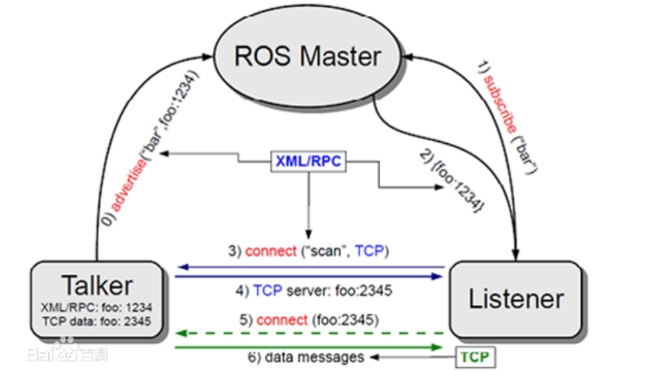
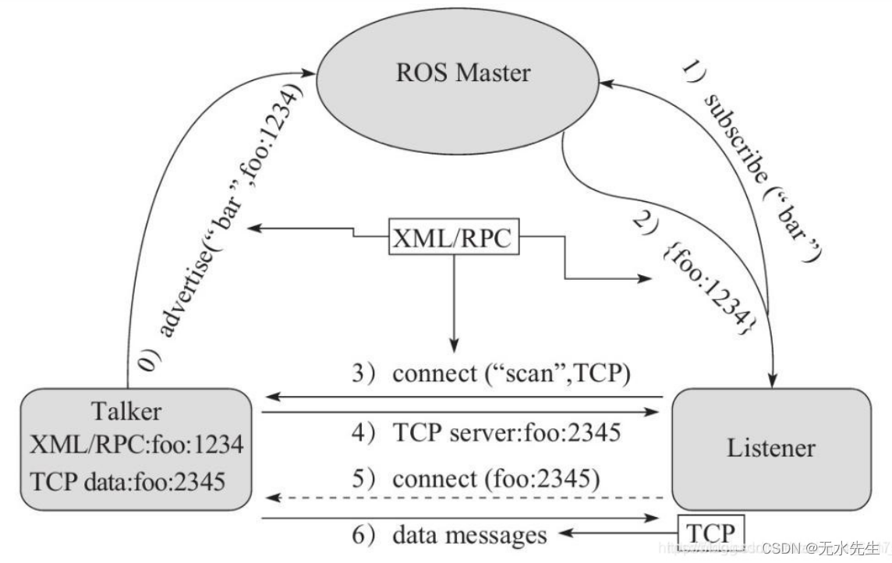
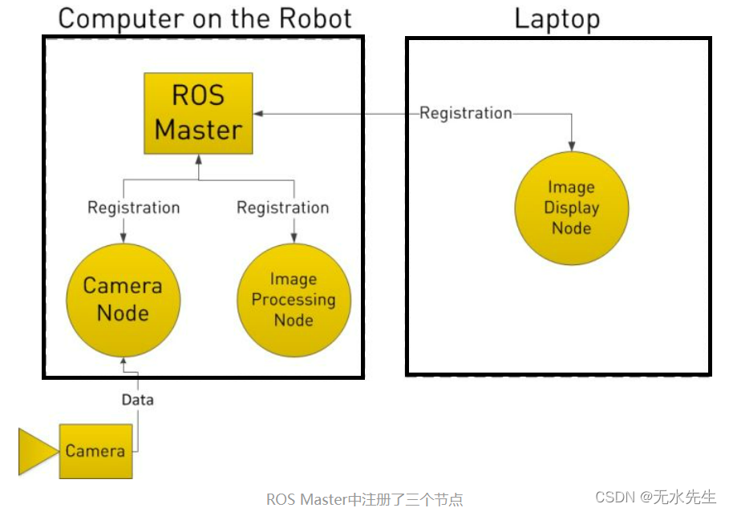
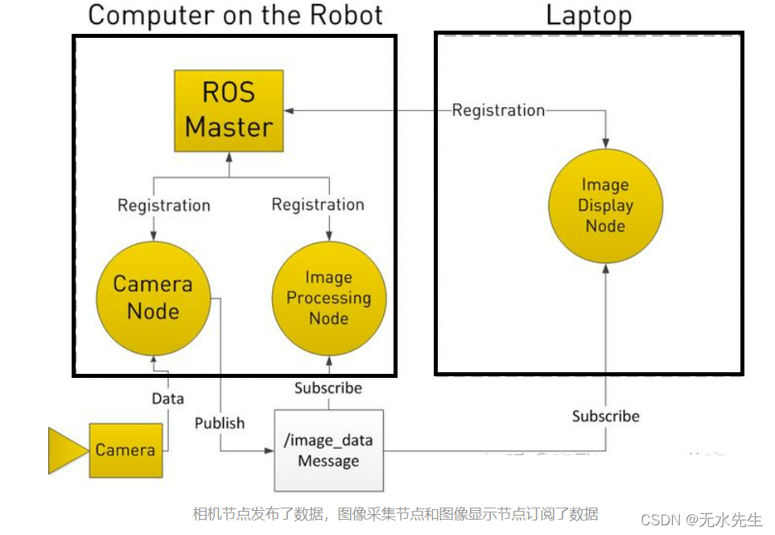
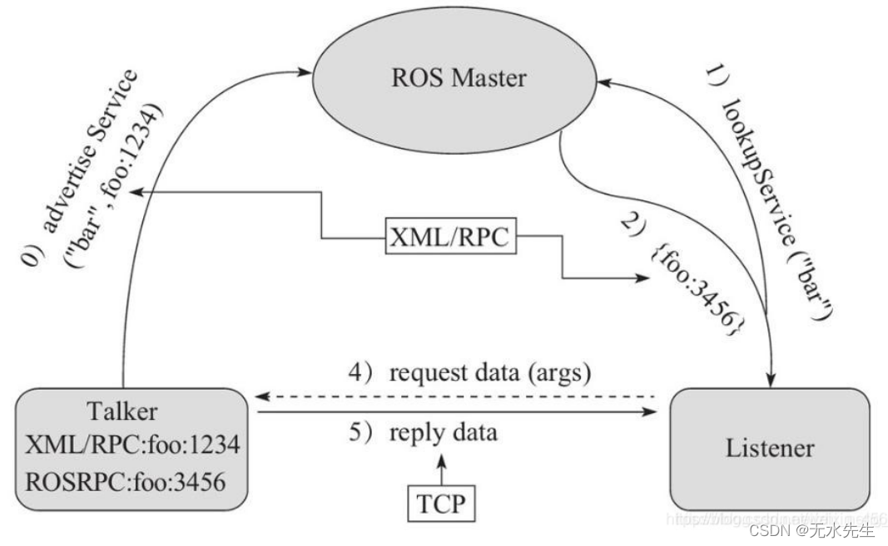
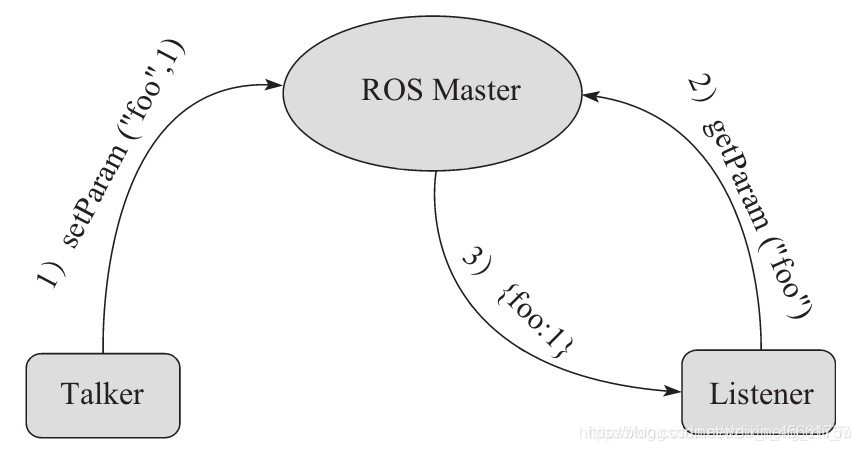
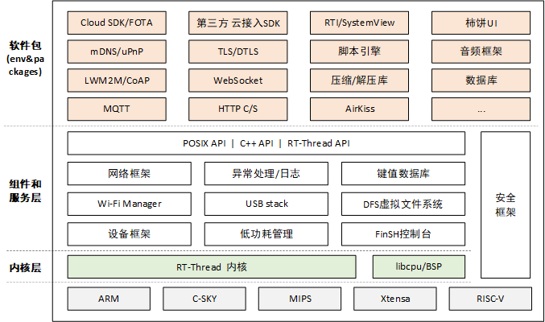

# 调研报告

[TOC]

## 小组成员

* 黄与进
* 刘津畅
* 陆子睦
* 唐星
* 杨涛

## 项目背景

随着智能硬件、物联网行业的迅猛发展, 嵌入式系统在各个领域都得到了广泛的应用。嵌入式操作系统可以帮助嵌入式设备更好地完成任务的调度，从而更高效地完成任务。目前，嵌入式系统正在向着功能日趋复杂，多机联合，分布式等方面发展。这些复杂的应用需要有较大的运算量，而传统的单片机是无法完成这些复杂的计算的。同时，要想实现复杂的功能，裸机编程也会因为过于困难且容易出错而难以实现。

鉴于以上这些背景，我们决定使用嵌入式操作系统RT_thread搭配ros的方式，来实现一个兼顾实时性和计算复杂性，符合当今嵌入式系统发展趋势的系统。

## 理论依据

### 嵌入式实时操作系统

嵌入式实时操作系统是指当外界事件或数据产生时，能够接受并以足够快的速度予以处理， 处理的结果又能在规定的时间之内来控制生产过程或对处理系统作出快速响应，并控制所有实时任务协调一致运行的嵌入式操作系统。主要用于工业控制、军事设备、航空航天等领域对系统的响应时间有苛刻的要求，这就需要使用实时系统。

#### 与通用操作系统的差异

由于嵌入式实时操作系统与通用操作系统的基本设计原则差别很大，因此在很多资源调度策略的选择上以及操作系统实现的方法上两者都具有较大的差异，这些差异主要体现在以下几点：

- 任务调度策略：
  通用操作系统中的任务调度策略一般采用基于优先级的抢先式调度策略，对于优先级相同的进程则采用时间片轮转调度方式，用户进程可以通过系统调用动态地调整自己的优先级，操作系统也可根据情况调整某些进程的优先级。
  嵌入式实时操作系统中的任务调度策略目前使用最广泛的主要可分为两种，一种是静态表驱动方式，另一种是固定优先级抢先式调度方式。
- 内存管理：
  通用操作系统的虚存管理机制中由于采用了 LRU 等页替换算法，使得大部分的访存需求能够快速地通过物理内存完成。
  为解决虚存给系统带来的不可预测性，实时操作系统一般采用如下两种方式：一是在原有虚存管理机制的基础上增加页面锁功能，用户可将关键页面锁定在内存中，从而不会被 swap 程序将该页面交换出内存。二是采用静态内存划分的方式，为每个实时任务划分固定的内存区域。
- 中断处理：
  在通用操作系统中，大部分外部中断都是开启的，中断处理一般由设备驱动程序来完成。由于通用操作系统中的用户进程一般都没有实时性要求，而中断处理程序直接跟硬件设备交互，可能有实时性要求，因此中断处理程序的优先级被设定为高于任何用户进程。
  但对于嵌入式实时操作系统采用上述的中断处理机制是不合适的。一个实时任务在运行时被中断处理程序阻塞的时间开销也是不可预测的，从而使任务的实时性得不到保证。
- 系统调用以及系统内部操作的时间开销：
  为保证系统的可预测性，实时操作系统中的所有系统调用以及系统内部操作的时间开销都应是有界的，并且该界限是一个具体的量化数值。而在通用操作系统中对这些时间开销则未做如此限制。
- 系统的可重入性：
  在通用操作系统中，核心态系统调用往往是不可重入的，当一低优先级任务调用核心态系统调用时，在该时间段内到达的高优先级任务必须等到低优先级的系统调用完成才能获得 CPU，这就降低了系统的可预测性。因此，嵌入式实时操作系统中的核心态系统调用往往设计为可重入的。
  嵌入式的这两种操作系统都有他们的用处，依靠嵌入式操作系统软件移植性大大提高网络协议更加丰富应用功能块逻辑清晰代码易读还能提供众多的开源工具、库以及软件。

#### 技术发展

进入20世纪90年代后，RTOS在嵌入式系统设计中的主导地位已经确定，越来越多的工程师使用RTOS，更多的新用户愿意选择购买而不是自己开发。我们注意到，RTOS的技术发展有以下一些变化：

- 因为新的处理器越来越多，RTOS自身结构的设计更易于移植，以便在短时间内支持更多种微处理器。
- 开放源码之风已波及RTOS厂家。数量相当多的RTOS厂家出售RTOS时，就附加了源程序代码并含生产版税。
-  后PC时代更多的产品使用RTOS，它们对实时性要求并不高，如手持设备等。微软公司的WinCE,Plam OS, Java OS等RTOS产品就是顺应这些应用而开发出来的。
-  电信设备、控制系统要求的高可靠性，对RTOS提出了新的要求。瑞典Enea公司的OSE和WindRiver 新推出的Vxwork AE对支持HA（高可用性）和热切换等特点都下了一番功夫。
-  Windriver收购了ISI，在RTOS市场形成了相当程度的垄断，但是由于Windriver决定放弃PSOS，转为开发Vxwork与PSOS合二为一版本，这便使得PSOS用户再一次走到重新选择RTOS的路口，给了其他RTOS厂家1次机会。
-  嵌入式Linux已经在消费电子设备中得到应用。韩国和日本的一些企业都推出了基于嵌入式Linux的手持设备。嵌入式Linux得到了相当广泛的半导体厂商的支持和投资，如Intel和 Motorola。

#### 应用场景

RTOS可划分为3个不同的领域：

- 系统级：指RTOS运行在1个小型的计算机系统中完成实时的控制作用。这个领域将主要是微软与Sun竞争之地，传统上Unix在这里占有绝对优势。Sun通过收购，让他的Solaris与 Chrous os（原欧洲的1种RTOS）结合，微软力推NT的嵌入式版本"Embedded NT"。此外，嵌入式Linux将依托源程序码开放和软件资源丰富的优势，进入系统级RTOS的市场。

- 板级：传统的RTOS的主要市场。如Vxwork, PSOS, QNX, Lynx和VRTX的应用将主要集中在航空航天、电话电讯等设备上。

- SOC级（即片上系统）：新一代RTOS的领域：主要应用在消费电子、互联网络和手持设备等产品上。代表的产品有Symbian 的Epoc、ATI 的Nucleus, Express logic 的Threadx。老牌的RTOS厂家的产品VRTX和Vxwork 也很注意这个市场。

  

### 机器人操作系统ROS

 ros是机器人操作系统（Robot Operating System）的英文缩写。ROS是用于编写机器人软件程序的一种具有高度灵活性的软件架构。 提供了操作系统应有的服务，包括硬件抽象，底层设备控制，常用函数的实现，进程间消息传递，以及包管理。它也提供用于获取、编译、编写、和跨计算机运行代码所需的工具和库函数。

  

ROS 的主要目标是为机器人研究和开发提供代码复用的支持。ROS是一个分布式的进程（也就是“节点”）框架，这些进程被封装在易于被分享和发布的程序包和功能包中。ROS也支持一种类似于代码储存库的联合系统，这个系统也可以实现工程的协作及发布。这个设计可以使一个工程的开发和实现从文件系统到用户接口完全独立决策（不受ROS限制）。同时，所有的工程都可以被ROS的基础工具整合在一起。

虽然名叫机器人操作系统，但它其实并不是一个操作系统，而只是一些软件包，它的实时性完全是由它运行在其上的操作系统实现的，而传统上ros一般运行在Linux系统上或是运行在裸机上，然而Linux系统并不是专门的实时性操作系统，它的实时性并不是很好，而裸机编程又过于复杂不适合实现丰富的所以我们决定在实时性操作系统RT-thread上运行ros，通过ros来与主节点上的ros通信，并可以把需要进行复杂的计算的信息发送给运行在PC端的主节点上的ros，在PC端进行运算，再通过运行结果来决定嵌入式系统的一些操作。

#### ROS通信机制

ROS是一个分布式框架，为用户提供多节点（进程）之间的通信服务，所有软件功能和工具都建立在这种分布式通信机制上，所以ROS的通信机制是最底层也是最核心的技术。在大多数应用场景下，尽管我们不需要关注底层通信的实现机制，但是了解其相关原理一定会帮助我们在开发过程中更好地使用ROS。ROS最核心的三种通信机制如下。

- Topic机制

- service机制
- 共享参数机制

##### Topic机制

话题在ROS中使用最为频繁，其通信模型也较为复杂。在ROS中有两个节点：一个是发布者Talker，另一个是订阅着Listener。两个节点分别发布、订阅同一个话题，启动顺序没有强制要求，此处假设Talker首先启动，可分为如下七步分析建立通信的详细过程。

1. Talker注册
    Talker启动，通过1234端口使用RPC向ROS Master注册发布者的信息，包含所发布消息的话题名;ROS Master会将节点的注册信息加入注册列表中。

2. Listener注册
   Listener启动，同样通过RPC向ROS Master注册订阅者的信息，包含需要订阅的话题名。

3. ROS Master进行信息匹配
   Master根据Listener的订阅信息从注册列表中进行查找，如果没有找到匹配的发布者，则等待发布者的加入：如果找到匹配的发布者信息，则通过RPC向Listener发送Talker的RPC地址信息。

4. Listener发送连接请求
   Listener接收到Master发回的Talker地址信息，尝试通过RPC向Talker发送连接请求，传输订阅的话题名、消息类型以及通信协议（TCP/UDP）

5. Talker确认连接请求
   Talker接收到Listener发送的连接请求后，继续通过RPC向Listener确认连接信息，其中包含自身的TCP地址信息。

6. Listener尝试与Talker建立网络连接
   Listener接收到确认信息后，使用TCP尝试与Talker建立网络连接。

7. Talker向Listener发布数据
   成功建立连接后，Talker开始向Listener发送话题消息数据。

   从上面的分析中可以发现，前五个步骤使用的通信协议都是RPC，最后发布数据的过程才使用到TCP。ROS Master在节点建立连接的过程中起到了重要作用，但是并不参与节点之间最终的数据传输。

   

##### 实例：相机机器人

此时我们有一台搭载了相机的机器人，我们希望机器人能够获取并处理相机采集的图像数据，同时可以在笔记本上看到这些图像。因此，我们定义了三个节点：相机节点（Camera Node）、图像处理节点（Image Processing Node）和图像显示节点（Image Display Node）。所有的节点都注册在节点管理器（ROS Master）中，管理器可以视为一个查询表，各个节点能查到消息要发送到其他的哪个节点。

节点可以发布消息到话题，或通过订阅某个话题来接受消息。完成注册后，Camera Node声明它发布（Publish）了一个叫做/image_data的话题（Topic）。Image Processing Node和Image Display Node声明它们订阅（Subscribe）了这个Topic。话题中数据为Message，具有一定类型和数据结构（ROS中提供了标准数据类型，用户也可自己定义），当Camera Node接收到相机发动的数据后，就立即将数据发送到另外两个节点上。

##### 服务通信机制

与话题的通信相比，其减少了Listener与Talker之间的RPC通信。

1. Talker注册
   Talker启动，通过1234端口使用RPC向ROS Master注册发布者的信息，包含所提供的服务名;ROS Master会将节点的注册信息加入注册列表中。
2. Listener注册
   Listener启动，同样通过RPC向ROS Master注册订阅者的信息，包含需要订阅的服务名。
3. ROS Master进行信息匹配
   Master根据Listener的订阅信息从注册列表中进行查找，如果没有找到匹配的服务提供者，则等待该服务的提供者加入：如果找到匹配的服务提供者信息，则通过RPC向Listener发送Talker的TCP地址信息。
4. Listener与Talker建立网络连接
   Listener接收到确认信息后，使用TCP尝试与Talker建立网络连接，并且发送服务的请求数据。
5. Talker向Listener发布服务应答数据
   Talker接收到服务请求和参数后，开始执行服务功能，执行完成后，向Listener发送应答数据。

##### 参数管理机制

参数类似于ROS中的全局变量，由ROS Master进行管理，其通信机制较为简单，不涉及TCP/UDP的通信。

1. Talker设置变量
           Talker使用RPC向ROS Master发送参数设置数据，包含参数名和参数值;ROS Master会将参数名和参数值保存到参数列表中。

2. Listener查询参数值
           Listener通过RPC向ROS Master发送参数查找请求，包含所要查找的参数名。

3. ROS Master向Listener发送参数值        Master根据Listener的查找请求从参数列表中进行查找，查找到参数后，使用RPC将参数值发送给Listener。

   

### RT-thread

RT-Thread，全称是 Real Time-Thread，顾名思义，它是一个嵌入式实时多线程操作系统，基本属性之一是支持多任务，允许多个任务同时运行并不意味着处理器在同一时刻真地执行了多个任务。事实上，一个处理器核心在某一时刻只能运行一个任务，由于每次对一个任务的执行时间很短、任务与任务之间通过任务调度器进行非常快速地切换（调度器根据优先级决定此刻该执行的任务），给人造成多个任务在一个时刻同时运行的错觉。在 RT-Thread 系统中，任务通过线程实现的，RT-Thread 中的线程调度器也就是以上提到的任务调度器。

RT-Thread 主要采用 C 语言编写，浅显易懂，方便移植。它把面向对象的设计方法应用到实时系统设计中，使得代码风格优雅、架构清晰、系统模块化并且可裁剪性非常好。针对资源受限的微控制器（MCU）系统，可通过方便易用的工具，裁剪出仅需要 3KB Flash、1.2KB RAM 内存资源的 NANO 版本（NANO 是 RT-Thread 官方于 2017 年 7 月份发布的一个极简版内核)；而对于资源丰富的物联网设备，RT-Thread 又能使用在线的软件包管理工具，配合系统配置工具实现直观快速的模块化裁剪，无缝地导入丰富的软件功能包，实现类似 Android 的图形界面及触摸滑动效果、智能语音交互效果等复杂功能。

相较于 Linux 操作系统，RT-Thread 体积小，成本低，功耗低、启动快速，除此以外 RT-Thread 还具有实时性高、占用资源小等特点，非常适用于各种资源受限（如成本、功耗限制等）的场合。虽然 32 位 MCU 是它的主要运行平台，实际上很多带有 MMU、基于 ARM9、ARM11 甚至 Cortex-A 系列级别 CPU 的应用处理器在特定应用场合也适合使用 RT-Thread。

#### 架构

近年来，物联网（Internet Of Things，IoT）概念广为普及，物联网市场发展迅猛，嵌入式设备的联网已是大势所趋。终端联网使得软件复杂性大幅增加，传统的 RTOS 内核已经越来越难满足市场的需求，在这种情况下，物联网操作系统（IoT OS）的概念应运而生。物联网操作系统是指以操作系统内核（可以是 RTOS、Linux 等）为基础，包括如文件系统、图形库等较为完整的中间件组件，具备低功耗、安全、通信协议支持和云端连接能力的软件平台，RT-Thread 就是一个 IoT OS。
RT-Thread 与其他很多 RTOS 如 FreeRTOS、uC/OS 的主要区别之一是，它不仅仅是一个实时内核，还具备丰富的中间层组件，如下图所示。

它具体包括以下部分:

- 内核层：RT-Thread 内核，是 RT-Thread 的核心部分，包括了内核系统中对象的实现，例如多线程及其调度、信号量、邮箱、消息队列、内存管理、定时器等; libcpu/BSP（芯片移植相关文件 / 板级支持包）与硬件密切相关，由外设驱动和 CPU 移植构成。
- 组件与服务层：组件是基于 RT-Thread 内核之上的上层软件，例如虚拟文件系统、FinSH 命令行界面、网络框架、设备框架等。采用模块化设计，做到组件内部高内聚，组件之间低耦合。
- RT-Thread 软件包：运行于 RT-Thread 物联网操作系统平台上，面向不同应用领域的通用软件组件，由描述信息、源代码或库文件组成。RT-Thread 提供了开放的软件包平台，这里存放了官方提供或开发者提供的软件包，该平台为开发者提供了众多可重用软件包的选择，这也是 RT-Thread 生态的重要组成部分。软件包生态对于一个操作系统的选择至关重要，因为这些软件包具有很强的可重用性，模块化程度很高，极大的方便应用开发者在最短时间内，打造出自己想要的系统。RT-Thread 已经支持的软件包数量已经达到 400+，如下举例：
  - 物联网相关的软件包：Paho MQTT、WebClient、mongoose、WebTerminal 等等。
  - 脚本语言相关的软件包：目前支持 Lua、JerryScript、MicroPython、PikaScript。
  - 多媒体相关的软件包：Openmv、mupdf。
  - 工具类软件包：CmBacktrace、EasyFlash、EasyLogger、SystemView。
  - 系统相关的软件包：RTGUI、Persimmon UI、lwext4、partition、SQLite 等等。
  - 外设库与驱动类软件包：RealTek RTL8710BN SDK。
  - 其他。

其中，我们需要用到软件包rosserial实现通信功能。

## 项目设计

### RT-thread-ros多车调度：

目前仍处于疫情防控期，智能消毒机器人得到了广泛应用。由机器人自动沿规划路线进行消杀工作，不仅高效，而且安全。受到此应用场景的启发，我们尝试实现一个多机协作完成定点“消杀”的应用。

实现目标：车a进行巡逻，通过摄像头采集数据，采集完毕后将地点信息发送到ros端，ros端对信息进行处理后，发消息指示车b的行驶。 我们需要建立RT-thread上的ros和PC端的ros之间的通信，分别对两辆车和ros端进行部署，使它们协同工作。

## 相关工作

- 具有避障、目标识别、蓝牙遥控等功能的智能车

- 数据采集、信息监测、监控系统。

- 智能园区物联系统。

  

## 参考文献

[嵌入式实时操作系统](https://blog.csdn.net/Bruce_Qee/article/details/51985851)

 [RT-Thread, RTOS, 物联网操作系统 - RT-Thread物联网操作系统](https://www.rt-thread.org/) 

 [RT-Thread 简介](https://www.rt-thread.org/document/site/#/rt-thread-version/rt-thread-standard/README) 

 [ros（机器人操作系统）_百度百科 (baidu.com)](https://baike.baidu.com/item/ros/4710560) 

 [ros图片_百度百科 (baidu.com)](https://baike.baidu.com/pic/ros/4710560/0/7870145557bce9aab645ae31?fr=lemma&ct=single#aid=1&pic=4e4a20a4462309f717e9339e780e0cf3d6cad6bc) 

[RT-Thread应用项目汇总](https://club.rt-thread.org/ask/article/aa977b5845b4ac0c.html)

[基于LoRaWAN的智能园区物联系统](https://club.rt-thread.org/ask/question/954ad561e8f08a37.html)

 [分布式温度监控系统](https://www.rt-thread.org/document/site/#/rt-thread-version/rt-thread-standard/tutorial/temperature-system/sensor.md)

[激光雷达避障小车](https://mp.weixin.qq.com/s/rjKExoGqhI1cPErGogEHDQ)

