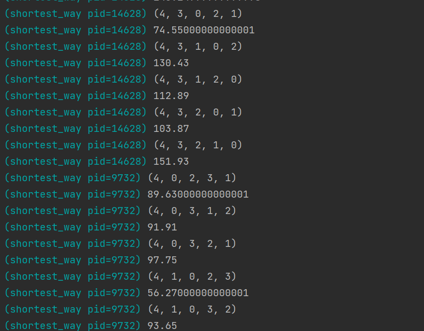
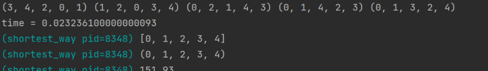
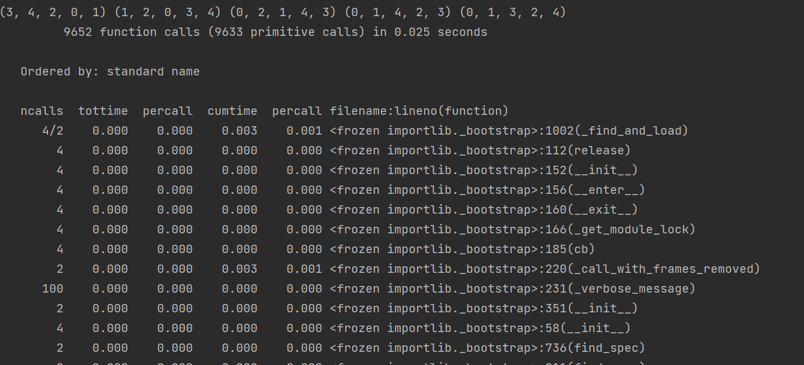
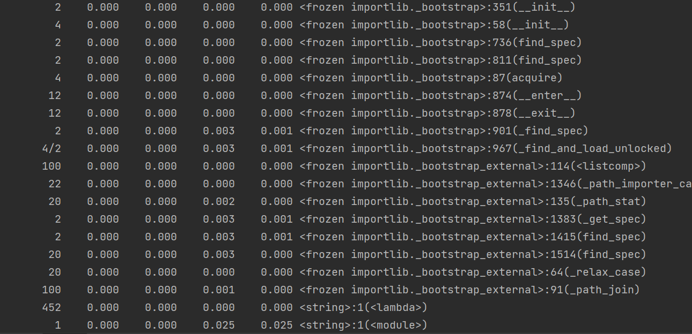
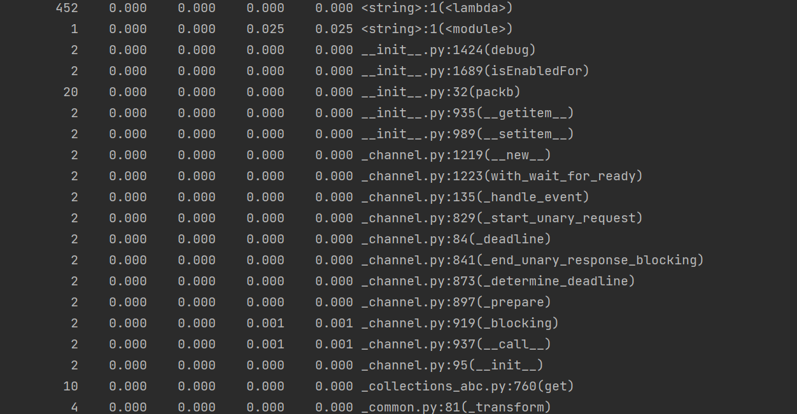
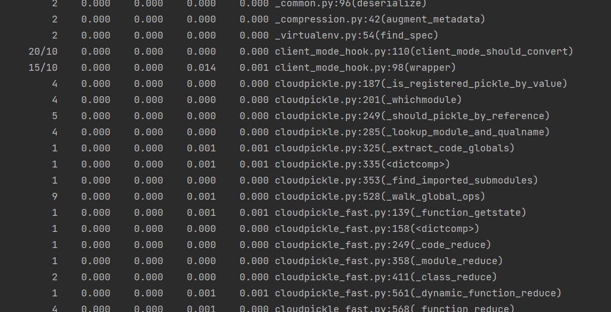
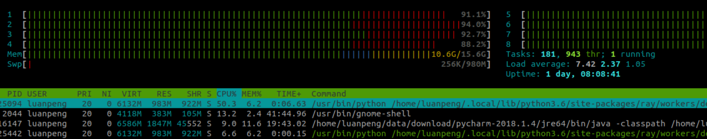

# lab4 报告

### ——对小车最佳路径计算算法的ray部署和测试


### 分析：

我们组的选题是ros-RT-thread系统，实现PC端ros负责复杂计算，stm32端ros负责控制电机等实时性任务，而PC端的复杂计算就可以用到本次实验中ray部署的分布式并行计算。

所以，我们把我们组最重要也是计算复杂性最高的小车最佳路径算法的程序进行了基于ray的部署和测试。

### 可以参考的指标：

1.延迟（Delay）

延迟就是从数据传入到结果输出之间的时间，这对于一个需要控制实时系统工作的程序是至关重要的，如果不能成功降低延迟，这个系统的工作性能无疑是非常差的。

2.吞吐量（Throughput）

对于软件系统来说，“吞”进去的是请求，“吐”出来的是结果，而吞吐量反映的就是软件系统的“饭量”，也就是系统的处理能力，具体说来，就是指软件系统在每单位时间内能处理多少个事务/请求/单位数据等。当面对多个节点的控制时，吞吐量也十分重要。

3.资源使用率（Resource utilization）

常见的资源有：CPU占用率、内存使用率、磁盘I/O、网络I/O。

4.并发数 （Concurrency Level ）

并发数体现了主节点能够处理的分支节点数，这对于ros-RT-thread的可扩展性非常重要。

5.错误率（ Error Rate ）

体现了程序出现错误的几率，这体现我们的实时系统的可靠性。


我们将选择延迟、资源使用率和并发数进行测试。

## ray单机部署

我们首先把程序通过ray部署到了单机上

```python
import itertools
import ray

ray.init()

@ray.remote
def distance(x1, y1, x2, y2):
    ans = (x1 - x2) * (x1 - x2) + (y1 - y2) * (y1 - y2)
    return ans

@ray.remote
def shortest_way(Location, n):
    dis = [[0.0] * 1005] * 1005
    #找到所给坐标点的最短访问序列，并返回调整过的坐标序列
    min_dis = 10000000000000
    for i in range(0, n):
        for j in range(0, n):
            dis[i][j] = (Location[2 * i] - Location[2 * j]) * (Location[2 * i] - Location[2 * j]) + (Location[2 * i + 1] - Location[2 * j + 1]) * (Location[2 * i + 1] - Location[2 * j + 1])
    nums = []
    ......(略)
    
    
def fun():
    id0 = shortest_way.remote(Location[0], 5)
    id1 = shortest_way.remote(Location[1], 5)
    id2 = shortest_way.remote(Location[2], 5)
    id3 = shortest_way.remote(Location[3], 5)
    id4 = shortest_way.remote(Location[4], 5)

    re0 = ray.get(id0)
    re1 = ray.get(id1)
    re2 = ray.get(id2)
    re3 = ray.get(id3)
    re4 = ray.get(id4)


    print(re0, re1, re2, re3, re4)

fun()
```


这是运行结果的部分截图：




### 性能测试：

#### 延迟：

我们首先用timeit测试了总的延迟时间：




然后用cProfile测试了各个函数调用的延迟时间：










资源使用率如下:




## 优化


 以线性方式聚合值与以树形结构方式聚合值的对比 ， 右图方式的聚合函数会比左图方式的聚合更高效

所以我们试着尽量把函数调用组织成树形的结构，这样会有效缩短延迟。

