# lab4 报告

### ——对小车最佳路径计算算法的ray部署和测试


### 分析：

我们组的选题是ros-RT-thread系统，实现PC端ros负责复杂计算，stm32端ros负责控制电机等实时性任务，而PC端的复杂计算就可以用到本次实验中ray部署的分布式并行计算。

所以，我们把我们组最重要也是计算复杂性最高的小车最佳路径算法的程序进行了基于ray的部署和测试。

### 可以参考的指标：

1.响应时间(Rresponse Time）

响应时间就是从数据传入到结果输出之间的时间，这对于一个需要控制实时系统工作的程序是至关重要的，如果不能成功降低响应时间，这个系统的工作性能无疑是非常差的。

2.吞吐量（Throughput）

对于软件系统来说，“吞”进去的是请求，“吐”出来的是结果，而吞吐量反映的就是软件系统的“饭量”，也就是系统的处理能力，具体说来，就是指软件系统在每单位时间内能处理多少个事务/请求/单位数据等。当面对多个节点的控制时，吞吐量也十分重要。

3.资源使用率（Resource utilization）

常见的资源有：CPU占用率、内存使用率、磁盘I/O、网络I/O。

4.并发数 （Concurrency Level ）

并发数体现了主节点能够处理的分支节点数，这对于ros-RT-thread的可扩展性非常重要。

5.错误率（ Error Rate ）

体现了程序出现错误的几率，这体现我们的实时系统的可靠性。


我们将选择响应时间、资源使用率和吞吐量进行测试。

## ray单机部署

我们首先把程序通过ray部署到了单机上

```python
import itertools
import ray


ray.init()

@ray.remote
def distance(x1, y1, x2, y2):
    ans = (x1 - x2) * (x1 - x2) + (y1 - y2) * (y1 - y2)
    return ans


@ray.remote
def shortest_way(Location, n): #求局域最优解
    dis = [[0.0] * 1005] * 1005
    #找到所给坐标点的最短访问序列，并返回调整过的坐标序列
    min_dis = 10000000000000
    for i in range(0, n):
        for j in range(0, n):
            dis[i][j] = (Location[2 * i] - Location[2 * j]) * (Location[2 * i] - Location[2 * j]) + (Location[2 * i + 1] - Location[2 * j + 1]) * (Location[2 * i + 1] - Location[2 * j + 1])
 	......(略)
    return route


@ray.remote
def merge_route(route1, route2): #把局域最优解和成全局近似最优解
    length1 = len(route1)
    length2 = len(route2)
	......(略)

    return new_route


#存需要到达的点的位置
Location = [[1.5, 2.4, 3.2, 1.5, 2.8, 4.5, 8.3, 3.6, 4.8, 5.0]
, [3.5, 1.4, 6.2, 9.5, 1.8, 3.5, 6.3, 2.6, 7.8, 2.0]
......(略)


def fun():
    route0 = shortest_way.remote(Location[0], 5)
    route1 = shortest_way.remote(Location[1], 5)
    new_route1 = merge_route.remote(route0, route1)
    route2 = shortest_way.remote(Location[2], 5)
    new_route2 = merge_route.remote(new_route1, route2)
    route3 = shortest_way.remote(Location[3], 5)
    new_route3 = merge_route.remote(new_route2, route3)
    route4 = shortest_way.remote(Location[4], 5)
    new_route4 = merge_route.remote(new_route3, route4)
    route5 = shortest_way.remote(Location[4], 5)
    new_route5 = merge_route.remote(new_route4, route5)

    route = ray.get(new_route5)


    print(route)

fun()
```


这是运行结果的部分截图：

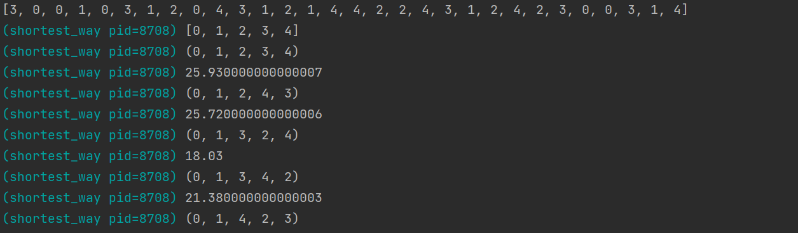


### 性能测试：

#### 响应时间：

我们首先用timeit测试了总的响应时间：

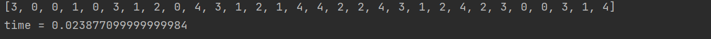


由于环境的关系，各次测的值有所波动，大致记录了7次

| 编号      | 1       | 2       | 3       | 4       | 5       | 6       | 7       | 平均值  |
| --------- | ------- | ------- | ------- | ------- | ------- | ------- | ------- | ------- |
| 时间（s） | 0.02387 | 0.02167 | 0.02341 | 0.02063 | 0.02524 | 0.02572 | 0.02344 | 0.02342 |

平均时间为0.02342

然后用cProfile测试了各个函数调用的延迟时间：

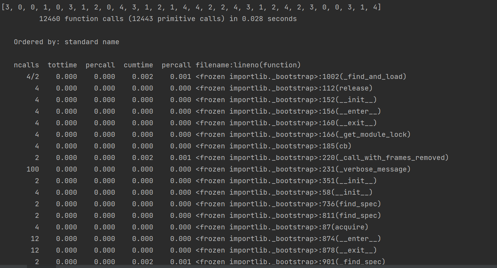

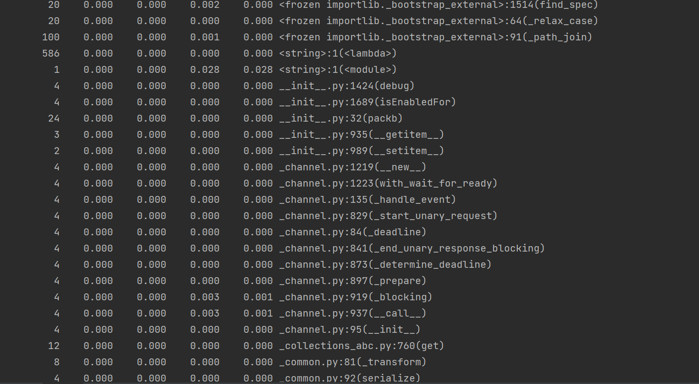


#### 吞吐量：

通过改变处理数据的数量，并测试对应的处理时间，我们可以测试吞吐量。

同时处理5组数据：

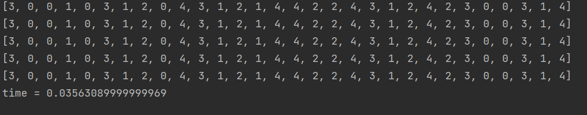

同时处理10组数据：

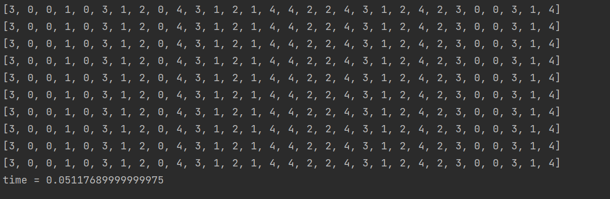

同时处理15组数据：

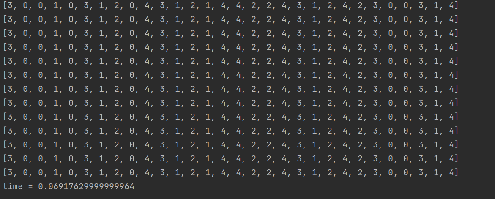

同时处理20组数据：

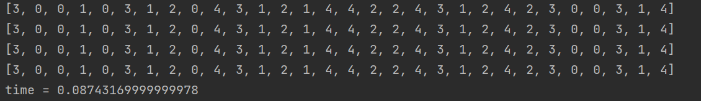

可见目前随着数据量的线性增加，时间基本上按照线性增加。


#### 内存占用情况：

通过 tracemalloc模块了解内存使用情况。

```python
tracemalloc.start()
fun()
current, peak = tracemalloc.get_traced_memory()
print(f"Current memory usage is {current / 10 ** 6}MB; Peak was {peak / 10 ** 6}MB")
tracemalloc.stop()
```

运行结果（一组数据）：

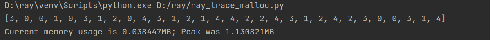

5组数据：

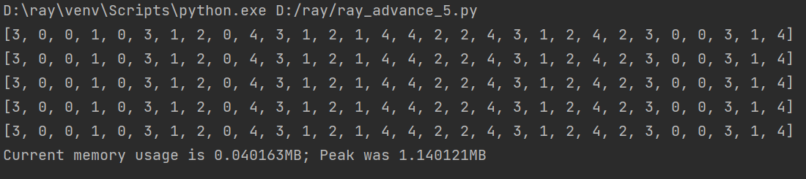

10组数据：

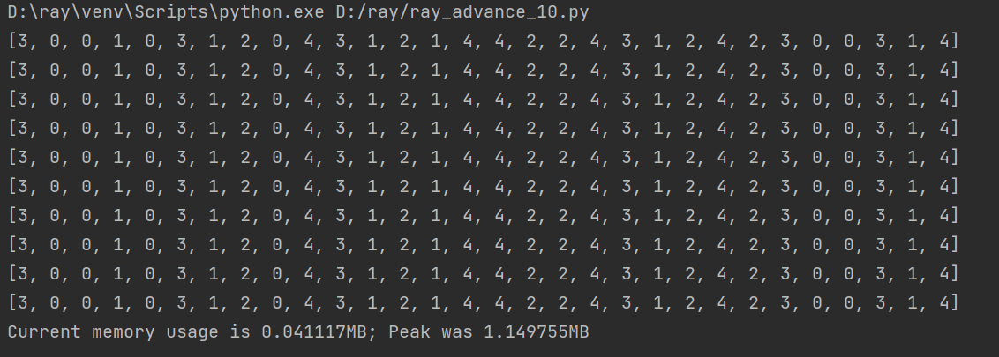

可见随着数据的增加，内存占用差别并不是很大，主要的内存占用可能还是框架本身造成的。


## 优化：

#### 优化方式1：改变ray框架函数调用结构，增加并行性

之前的代码中，函数调用的树用的是最直接的方法，导致调用的层数比较多，树比较高，接下来通过让函数调用树更加均衡，可以提高代码的并行效率。

```python
def fun():
    route0 = shortest_way.remote(Location[0], 5)
    route1 = shortest_way.remote(Location[1], 5)
    route2 = shortest_way.remote(Location[2], 5)
    route3 = shortest_way.remote(Location[3], 5)
    route4 = shortest_way.remote(Location[4], 5)
    route5 = shortest_way.remote(Location[5], 5)
    route6 = shortest_way.remote(Location[6], 5)
    route7 = shortest_way.remote(Location[7], 5)

    new_route1 = merge_route.remote(route0, route1)
    new_route2 = merge_route.remote(route2, route3)
    new_route3 = merge_route.remote(route4, route5)
    new_route4 = merge_route.remote(route6, route7)

    layer2_route1 = merge_route.remote(new_route1, new_route2)
    layer2_route2 = merge_route.remote(new_route3, new_route4)

    final_route = merge_route.remote(layer2_route1, layer2_route2)
    route = ray.get(final_route)


    print(route)
```

测量了运行时间：

| 序号      | 1       | 2       | 3       | 4       | 5       | 6       | 7       | 平均时间 |
| --------- | ------- | ------- | ------- | ------- | ------- | ------- | ------- | -------- |
| 时间（s） | 0.01938 | 0.02256 | 0.01898 | 0.02065 | 0.02113 | 0.02129 | 0.01902 | 0.02043  |

平均时间0.02043.

而优化前平均时间为0.02342，所以性能优化比为：
$$
\frac{0.02342}{0.02043} = 1.1464
$$
性能只提高了%14，并不是非常明显，还达不到要求。


由于我们的代码结构并不是十分复杂，好像也找不到什么其他优化的方式了，虽然也尝试了其他一些改进，但仍然达不到%20的要求，所以暂且只能这样了。


